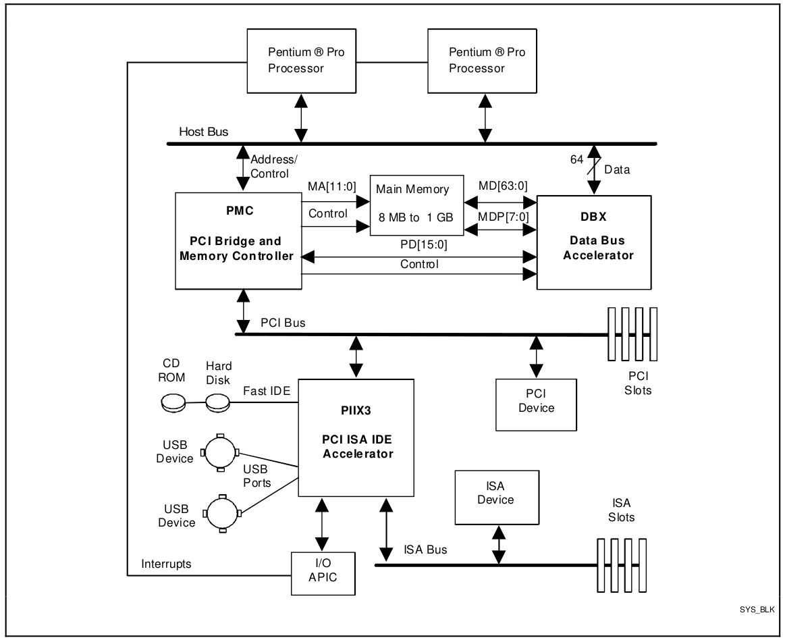

# QEMU Timer Interrupt

## Main Content

- Environment
- QEMU component
  - QEMU Main Loop and vCPU Thread
  - QEMU Clock and Timer
  - QEMU IRQ and GSI
- Timer Interrupt in QEMU
  - APIC Timer Interrupt Generation
  - Guest's Timer Interrupt Handler
- References

## Environment

|       |                version                 |       |
| :---: | :------------------------------------: | :---: |
| Host  |                 linux                  |       |
| QEMU  |       6.0.50 from master branch        |  TCG  |
| Guest | Ubuntu 10.04 Server with kernel 2.6.32 | qcow2 |

## QEMU component

### QEMU Main Loop and vCPU thread

**QEMU Main Loop**

```c
main()
-> qemu_init()
-> qemu_main_loop()
   -> while !main_loop_should_exit()
   -> main_loop_wait(fase)
      -> timeout_ns = qemu_soonest_timeout( ... main_loop_tlg ... )
      -> os_host_main_loop_wait(timeout_ns)
      |  -> context = g_main_context_default()	// 0. get the MainContext
      |  -> g_main_context_acquire(context)     // 1. acquire
      |  |
      |  -> glib_poolfds_fill(&timeout)
      |  |  -> g_main_context_prepare()         // 2. prepare
      |  |  -> FOREACH g_main_context_qurey()   // 3. query
      |  |  -> qemu_soonest_timeout()
      |  |
      |  -> qemu_mutex_unlock_iothread()
      |  -> qemu_poll_ns()
      |  -> qemu_mutex_lock_iothread()
      |  |
      |  -> glib_pollfds_poll()
      |  |  -> if g_main_context_check()        // 4. check
      |  |  -> g_main_context_dispatch()        // 5. dispatch
      |  |
      |  -> g_main_context_release(context)     // 6. release
      -> qemu_clock_run_all_timers()
```

**QEMU vCPU thread**

```c
qemu_init_vcpu()
-> cpu_accel->create_vcpu_thread(cpu)
   rr_start_vcpu_thread(cpu)
   -> qemu_thread_create(..., rr_cpu_thread_fn, ...)
      -> rr_cpu_thread_fn()
         -> rr_start_kick_timer()
         -> while (1)
            -> while (cpu && cpu_work_list_empty(cpu) && !cpu->exit_request)
            |  -> tcg_cpus_exec(cpu)
            |  |  -> cpu_exec_start(cpu)
            |  |  |  -> qatomic_set(&cpu->running, true)
            |  |  -> cpu_exec(cpu)
            |  |  |  -> cpu_exec_enter(cpu)
            |  |  |  -> sigsetjmp(cpu->jmp_env, 0)
            |  |  |  -> while (!cpu_handle_exception(cpu))
            |  |  |  |  -> while (!cpu_handle_interrupt(cpu))   // QEMU handle interrupt
            |  |  |  |     -> tb = tb_find()
            |  |  |  |     -> cpu_loop_exec_tb(tb)
            |  |  |  -> cpu_exec_exit(cpu)
            |  |  -> cpu_exec_end(cpu)
            |  |  |  -> qatomic_set(&cpu->running, false)
            |  -> cpu = CPU_NEXT(cpu)
            -> rr_wait_io_event()
```


### QEMU Clock and Timer

#### QEMU Clock

 **Summary of clock-related data and functions in QEMU** 

- `qemu_clock_get_ns(type)` in `qemu/timer.h` 
  - 4 types of clock `REALTIME` `VIRTUAL` `HOST` `VIRTUAL_RT` 
  - **REALTIME** return `get_clock` : ns start from host boot
  - **VIRTUAL** return `cpus_get_virtual_clock()` : ns start from guest boot
  - **HOST** return `get_clock_realtime()` : ns of host real time (from 1970)
  - **VIRTUAL_RT** return `cpu_get_clock()` :  ns start from guest boot
- `qemu_clock_get_ms(type)` in `qemu/timer.h` 
  - simply return `qemu_clock_get_ns(type)` / 1000
- **REALTIME** `get_clock()` in `qemu/timer.h` 
  - return the ns start from host boot
  - `clock_gettime(CLOCK_MONOTONIC, &ts)` 
- **HOST** `get_clock_realtime()` in `qemu/timer.h` 
  - simply call `gettimeofday()` and plus the reasult with 1000 to get ns
- **☆ VIRTUAL** `cpus_get_virtual_clock()` in `sysemu/cpu-timers.h` 
  - implemented in `softmmu/cpus.c` 
  - First, try `cpu_accel->get_virtual_clock()` function
  - Otherwiser, use `cpu_get_clock()` 
- **☆ VIRTUAL_RT** `cpu_get_clock()` in `sysemu/cpu-timers.h` 
  - `get_clock()` plus `timers_state.cpu_clock_offset` to get ns start from guest boot
- `cpu_get_host_ticks()` in `qemu/timer.h` 
  - return host ticks through `rdtsc` in i386/x86_63 architecture
  - for architecture not defined, use `get_clock` instead

---

 **Initialization of QEMU Clock** 

```c
(gdb) bt
#0  in cpu_enable_ticks () at ../softmmu/cpu-timers.c:110
#1  in vm_prepare_start () at ../softmmu/cpus.c:690
#2  in vm_start () at ../softmmu/cpus.c:698
#3  in qmp_cont (errp=errp@entry=0x0) at ../monitor/qmp-cmds.c:152
#4  in qmp_x_exit_preconfig (errp=<>) at ../softmmu/vl.c:2618
#5  in qmp_x_exit_preconfig (errp=<>) at ../softmmu/vl.c:2585
#6  in qemu_init (argc=<>, argv=<>, envp=<>) at ../softmmu/vl.c:3633
#7  in main (argc=<>, argv=<>, envp=<>) at ../softmmu/main.c:49

void cpu_enable_ticks(void)
{
    seqlock_write_lock(&timers_state.vm_clock_seqlock,
                       &timers_state.vm_clock_lock);
    if (!timers_state.cpu_ticks_enabled) {
        timers_state.cpu_ticks_offset -= cpu_get_host_ticks(); // 0 - current time
        timers_state.cpu_clock_offset -= get_clock();          // 0 - current time
        timers_state.cpu_ticks_enabled = 1;
    }
    seqlock_write_unlock(&timers_state.vm_clock_seqlock,
                       &timers_state.vm_clock_lock);
}
```

**REALTIME** `get_clock()` in `qemu/timer.h` 

```c
static inline int64_t get_clock(void)
{
    if (use_rt_clock) {
        struct timespec ts;
        clock_gettime(CLOCK_MONOTONIC, &ts);   // clock_gettime()
        return ts.tv_sec * 1000000000LL + ts.tv_nsec;
    } else {
        /* XXX: using gettimeofday leads to problems if the date
           changes, so it should be avoided. */
        return get_clock_realtime();              // gettimeofday()
    }
}

/* util/qemu-timer-common.c */
int use_rt_clock;

static void __attribute__((constructor)) init_get_clock(void)
{
    struct timespec ts;

    use_rt_clock = 0;
    if (clock_gettime(CLOCK_MONOTONIC, &ts) == 0) {  // as long as clock_gettime() is ok
        use_rt_clock = 1;
    }
    clock_start = get_clock();
}
```

**HOST** `get_clock_realtime()` in `qemu/timer.h` 

```c
/* include/qemu/timer.h */
static inline int64_t get_clock_realtime(void)
{
    struct timeval tv;

    gettimeofday(&tv, NULL);
    return tv.tv_sec * 1000000000LL + (tv.tv_usec * 1000);
}
```

**☆ VIRTUAL** `cpus_get_virtual_clock()` in `sysemu/cpu-timers.h` 

```c
/* softmmu/cpus.c */
int64_t cpus_get_virtual_clock(void)
{
    if (cpus_accel && cpus_accel->get_virtual_clock) {
        return cpus_accel->get_virtual_clock();
    }
    return cpu_get_clock();
}
```

**☆ VIRTUAL_RT** `cpu_get_clock()` in `sysemu/cpu-timers.h` 

```c
/* softmmu/cpu-timers.c */
int64_t cpu_get_clock_locked(void)
{
    int64_t time;

    time = timers_state.cpu_clock_offset;
    if (timers_state.cpu_ticks_enabled) {
        time += get_clock();
    }

    return time;
}

int64_t cpu_get_clock(void)
{
    int64_t ti;
    unsigned start;

    do {
        start = seqlock_read_begin(&timers_state.vm_clock_seqlock);
        ti = cpu_get_clock_locked();
    } while (seqlock_read_retry(&timers_state.vm_clock_seqlock, start));

    return ti;
}
```

---

#### QEMU IRQ and GSI

 **QEMU IRQ** 

```c
/* include/qemu/typedefs.h */
typedef struct IRQState *qemu_irq;

/* hw/core/irq.c */
struct IRQState {
    Object parent_obj;
    
    qemu_irq_handler handler;
    void *opaque;
    int n;
};
```

```c
/* hw/core/irq.c */
void qemu_set_irq(qemu_irq irq, int level)
{
    irq->handler(irq->opaque, irq->n, level);
}

/* include/hw/irq.h */
static inline void qemu_irq_raise(qemu_irq irq)
{
    qemu_set_irq(irq, 1); // 设置为上升沿
}

static inline void qemu_irq_lower(qemu_irq irq)
{
    qemu_set_irq(irq, 0); // 设置为下降沿
}

static inline void qemu_irq_pulse(qemu_irq irq)
{
    qemu_set_irq(irq, 1);
    qemu_set_irq(irq, 0);
}
```

 **Hardware Initialization** 



```c
pc_init1()
-> x86_cpus_init() : X86MachineState *x86ms
|	-> x86_cpu_realizefn() : X86CPU
|		-> x86_cpu_apic_create() : xcpu->apic_state
|		-> qemu_init_vcpu(cs) : create vCPU thread
|		-> x86_cpu_apic_realize() : map APIC MMIO area
-> pc_gsi_create() :  x86ms->gsi[24] and gsi_state
|                     // each x86ms->gsi[i] is an IRQ_STATE
|                     // whose opaque is the pointer to gsi_state
-> isa_bus_irqs() : isa_bus->irqs = x86ms->gsi
-> pc_i8259_create() : set gst_state->i8259_irq[8 * 2]
|	-> x86_allocate_cpu_irq() : parent IRQ with handler pic_irq_request()
|	-> i8259_init() : two 8259A chip connected
|       -> i8259_init_chip() : create 8259A and connect to isa_bus
|                              // create TYPE_I8259 "isa-i8259"
-> ioapic_init_gsi() : set gsi_state->ioapic_irq[24]
                       // create TYPE_IOAPIC "ioapic"
```

```c
/* hw/i386/pc_piix.c */
static void pc_init1(MachineState *machine,
                     const char *host_type, const char *pci_type)
{
    PCMachineState *pcms = PC_MACHINE(machine);
	PCMachineClass *pcmc = PC_MACHINE_GET_CLASS(pcms);
	X86MachineState *x86ms = X86_MACHINE(machine);

    x86_cpus_init(x86ms, pcmc->default_cpu_version);

    // global system interrupts
    gsi_state = pc_gsi_create(&x86ms->gsi, pcmc->pci_enabled);

    isa_bus_irqs(isa_bus, x86ms->gsi);	// #0#
    pc_i8259_create(isa_bus, gsi_state->i8259_irq); // #1#
    if (pcmc->pci_enabled) {
        ioapic_init_gsi(gsi_state, "i440fx");
    }
    if (tcg_enabled()) {
        x86_register_ferr_irq(x86ms->gsi[13]); // ?
    }
}

/* #0# hw/isa/isa-bus.c */
void isa_bus_irqs(ISABus *bus, qemu_irq *irqs)
{
    bus->irqs = irqs;
}

/* #1# hw/i386/pc.c */
void pc_i8259_create(ISABus *isa_bus, qemu_irq *i8259_irqs)
{
    qemu_irq *i8259;

    if (kvm_pic_in_kernel()) {
        i8259 = kvm_i8259_init(isa_bus);
    } else if (xen_enabled()) {
        i8259 = xen_interrupt_controller_init();
    } else {
        i8259 = i8259_init(isa_bus, x86_allocate_cpu_irq()); // #2#4#
    }

    for (size_t i = 0; i < ISA_NUM_IRQS; i++) { // #3#
        i8259_irqs[i] = i8259[i];
    }

    g_free(i8259);
}

/* #2# hw/i386/x86.c */
qemu_irq x86_allocate_cpu_irq(void)
{
    return qemu_allocate_irq(pic_irq_request, NULL, 0);
}

/* #3# include/hw/isa/isa.h */
#define ISA_NUM_IRQS 16

/* #4# hw/intc/i8259.c */
qemu_irq *i8259_init(ISABus *bus, qemu_irq parent_irq)
{
    qemu_irq *irq_set;
    DeviceState *dev;
    ISADevice *isadev;
    int i;

    irq_set = g_new0(qemu_irq, ISA_NUM_IRQS); // #3#

    isadev = i8259_init_chip(TYPE_I8259, bus, true); // #5#
    dev = DEVICE(isadev);

    qdev_connect_gpio_out(dev, 0, parent_irq); // #2#
    for (i = 0 ; i < 8; i++) {
        irq_set[i] = qdev_get_gpio_in(dev, i);
    }

    isa_pic = dev;

    isadev = i8259_init_chip(TYPE_I8259, bus, false); // #5#
    dev = DEVICE(isadev);

    qdev_connect_gpio_out(dev, 0, irq_set[2]);
    for (i = 0 ; i < 8; i++) {
        irq_set[i + 8] = qdev_get_gpio_in(dev, i);
    }

    slave_pic = PIC_COMMON(dev);

    return irq_set;
}

/* #5# hw/intc/i8259+common.c */
ISADevice *i8259_init_chip(
    const char *name, ISABus *bus, bool master)
{
    DeviceState *dev;
    ISADevice *isadev;

    isadev = isa_new(name);
    dev = DEVICE(isadev);
    qdev_prop_set_uint32(dev, "iobase", master ? 0x20 : 0xa0);
    qdev_prop_set_uint32(dev, "elcr_addr", master ? 0x4d0 : 0x4d1);
    qdev_prop_set_uint8(dev, "elcr_mask", master ? 0xf8 : 0xde);
    qdev_prop_set_bit(dev, "master", master);
    isa_realize_and_unref(isadev, bus, &error_fatal);

    return isadev;
}
```

```c
/* target/i386/cpu.h */
struct X86CPU {
    /*< private >*/
	CPUState parent_obj;

    struct DeviceState *apic_state;
};

/* target/i386/cpu.c */
APICCommonClass *apic_get_class(void)
{
    const char *apic_type = "apic";

    /* TODO: in-kernel irqchip for hvf */
    if (kvm_apic_in_kernel()) {
        apic_type = "kvm-apic";
    } else if (xen_enabled()) {
        apic_type = "xen-apic";
    } else if (whpx_apic_in_platform()) {
        apic_type = "whpx-apic";
    }

    return APIC_COMMON_CLASS(object_class_by_name(apic_type));
}

static void x86_cpu_apic_create(X86CPU *cpu, Error **errp)
{
    APICCommonState *apic;
    ObjectClass *apic_class = OBJECT_CLASS(apic_get_class());     // "apic"

    cpu->apic_state = DEVICE(object_new_with_class(apic_class));  // "apic"

    object_property_add_child(OBJECT(cpu), "lapic",
                              OBJECT(cpu->apic_state));
    object_unref(OBJECT(cpu->apic_state));

    qdev_prop_set_uint32(cpu->apic_state, "id", cpu->apic_id);
    /* TODO: convert to link<> */
    apic = APIC_COMMON(cpu->apic_state);
    apic->cpu = cpu;
    apic->apicbase = APIC_DEFAULT_ADDRESS | MSR_IA32_APICBASE_ENABLE;
}

static void x86_cpu_realizefn(DeviceState *dev, Error **errp)
{
    CPUState *cs = CPU(dev);
	X86CPU *cpu = X86_CPU(dev);
	X86CPUClass *xcc = X86_CPU_GET_CLASS(dev);
	CPUX86State *env = &cpu->env;
    
    /*... */
    
    cpu_exec_realizefn(cs, &local_err); // tcg_exec_realizefn(cpu, errp);

    /*... */
    
    if (cpu->env.features[FEAT_1_EDX] & CPUID_APIC || ms->smp.cpus > 1) {
        x86_cpu_apic_create(cpu, &local_err);  // cpu->apic_state
    }

    /*... */

    qemu_init_vcpu(cs); // cpus_accel->create_vcpu_thread(cpu);
                        // rr_start_vcpu_thread()
                        // -> qemu_thread_create( rr_cpu_thread_fn )
    
    x86_cpu_apic_realize(cpu, &local_err); // Map APIC MMIO area

    cpu_reset(cs); // x86_cpu_reset
}

static void x86_cpu_apic_realize(X86CPU *cpu, Error **errp)
{
    APICCommonState *apic;
    static bool apic_mmio_map_once;

    if (cpu->apic_state == NULL) {
        return;
    }
    qdev_realize(DEVICE(cpu->apic_state), NULL, errp);

    /* Map APIC MMIO area */
    apic = APIC_COMMON(cpu->apic_state);
    if (!apic_mmio_map_once) {
        memory_region_add_subregion_overlap(get_system_memory(),
                                            apic->apicbase &
                                            MSR_IA32_APICBASE_BASE,
                                            &apic->io_memory,
                                            0x1000);
        apic_mmio_map_once = true;
     }
}
```

```c
#0  0x000000aaab065198 in x86_cpu_realizefn (
#1  0x000000aaab21c6ac in device_set_realized (
#2  0x000000aaab1f4824 in property_set_bool (
#3  0x000000aaab1f7324 in object_property_set (
#4  0x000000aaab1f423c in object_property_set_qobject (
#5  0x000000aaab1f7598 in object_property_set_bool (
#6  0x000000aaab21b274 in qdev_realize (
#7  0x000000aaab0355c0 in x86_cpu_new (
#8  0x000000aaab0356b4 in x86_cpus_init (
#9  0x000000aaab047478 in pc_init1 (
#10 0x000000aaaaef7860 in machine_run_board_init (
#11 0x000000aaab102d0c in qemu_init_board (
#12 0x000000aaab102d0c in qmp_x_exit_preconfig (
#13 0x000000aaab10672c in qemu_init (
#14 0x000000aaaade65ec in main (
```

**GSI**

```c
/* include/hw/i386/x86.h */
#define GSI_NUM_PINS IOAPIC_NUM_PINS
#define ACPI_BUILD_PCI_IRQS ((1<<5) | (1<<9) | (1<<10) | (1<<11))

typedef struct GSIState {
    qemu_irq i8259_irq[ISA_NUM_IRQS];
    qemu_irq ioapic_irq[IOAPIC_NUM_PINS];
    qemu_irq ioapic2_irq[IOAPIC_NUM_PINS];
} GSIState;

/* hw/i386/pc.c */
GSIState *pc_gsi_create(qemu_irq **irqs, bool pci_enabled)
{
    GSIState *s;

    s = g_new0(GSIState, 1);
    if (kvm_ioapic_in_kernel()) {
        kvm_pc_setup_irq_routing(pci_enabled);
    }
    *irqs = qemu_allocate_irqs(gsi_handler, s, GSI_NUM_PINS); // 24

    return s;
}

/* include/hw/i386/ioapic.h */
#define IOAPIC_NUM_PINS 24

#define TYPE_KVM_IOAPIC "kvm-ioapic"
#define TYPE_IOAPIC "ioapic"

/* hw/i386/x86.c */
void gsi_handler(void *opaque, int n, int level)
{
    GSIState *s = opaque;

    trace_x86_gsi_interrupt(n, level);
    switch (n) {
    case 0 ... ISA_NUM_IRQS - 1:
        if (s->i8259_irq[n]) {
            /* Under KVM, Kernel will forward to both PIC and IOAPIC */
            qemu_set_irq(s->i8259_irq[n], level);
        }
        /* fall through */
    case ISA_NUM_IRQS ... IOAPIC_NUM_PINS - 1:
        qemu_set_irq(s->ioapic_irq[n], level);
        break;
    case IO_APIC_SECONDARY_IRQBASE
        ... IO_APIC_SECONDARY_IRQBASE + IOAPIC_NUM_PINS - 1:
        qemu_set_irq(s->ioapic2_irq[n - IO_APIC_SECONDARY_IRQBASE], level);
        break;
    }
}
```


## Timer Interrupt in QEMU

### Timer Interrupt Generation

```c
[fff6b11700] send interrupt 0x10             // fff6b11700 main thread
[fff4cce080] send interrupt 0x2              // fff4cce080 vCPU thread
[fff4cce080] do interrupt protected          // fff4cce080 vCPU thread
```

1. main thread apic timer send interrupt to vCPU thread

```c
#0  in tcg_handle_interrupt (cpu=0xfff4cd4010, mask=16)
#1  in apic_local_deliver ()
#2  in apic_timer ()
#3  in timerlist_run_timers ()
#4  in timerlist_run_timers ()
#5  in qemu_clock_run_all_timers ()
#6  in main_loop_wait ()
#7  in qemu_main_loop ()
#8  in main ()
```

2. vCPU thread handle interrupt

```c
#0  in tcg_handle_interrupt ()
#1  in x86_cpu_exec_interrupt ()
#2  in cpu_handle_interrupt ()
#3  in cpu_exec ()
#4  in tcg_cpus_exec ()
#5  in rr_cpu_thread_fn ()
#6  in qemu_thread_start ()
#7  in start_thread ()
#8  in  ()                          // pthread_create
```

3. x86 exec interrupt find out apic IRQ

```c
x86_cpu_exec_interrupt()
-> apic_poll_irq(cpu->apic_state);                  // CPU_INTERRUPT_POLL 0x10
   -> apic_update_irq(s); 
      -> if (apic_irq_pending(s) > 0)
         -> cpu_interrupt(cpu, CPU_INTERRUPT_HARD); // CPU_INTERRUPT_HARD 0x2

/* hw/intc/apic.c */
static int apic_irq_pending(APICCommonState *s)
{
    int irrv, ppr;

    if (!(s->spurious_vec & APIC_SV_ENABLE)) {
        return 0;
    }

    irrv = get_highest_priority_int(s->irr);	// interrupt priority by APIC
    if (irrv < 0) {
        return 0;
    }
    ppr = apic_get_ppr(s);
    if (ppr && (irrv & 0xf0) <= (ppr & 0xf0)) {
        return -1;
    }

    return irrv;
}
```

4. x86 exec interrupt do hard interrupt

```c
x86_cpu_exec_interrupt()
-> do_interrupt_x86_hardirq(env, intno, 1); // CPU_INTERRUPT_HARD 0x2
   -> do_interrupt_all()
      -> do_interrupt_protected()
```

### Guest Timer Interrupt Handler

```c
/* arch/x86/include/asm/irq_vectors.h */
#define LOCAL_TIMER_VECTOR	0xef			// 239

/* arch/x86/include/asm/entry_arch.h */
BUILD_INTERRUPT(apic_timer_interrupt,LOCAL_TIMER_VECTOR)

/* arch/x86/kernel/entry_32.S */
#define BUILD_INTERRUPT3(name, nr, fn)  \
ENTRY(name)             \
    RING0_INT_FRAME;        \
    pushl $~(nr);           \
    CFI_ADJUST_CFA_OFFSET 4;    \         
    SAVE_ALL;           \
    TRACE_IRQS_OFF          \
    movl %esp,%eax;         \
    call fn;            \
    jmp ret_from_intr;      \
    CFI_ENDPROC;            \
ENDPROC(name)

#define BUILD_INTERRUPT(name, nr)   BUILD_INTERRUPT3(name, nr, smp_##name)

/* arch/x86/kernel/apic/apic.c */
void __irq_entry smp_apic_timer_interrupt(struct pt_regs *regs)   
{                                                                 
    struct pt_regs *old_regs = set_irq_regs(regs);                
                                                                  
    /*                                                            
     * NOTE! We'd better ACK the irq immediately,                 
     * because timer handling can be slow.                        
     */                                                           
    ack_APIC_irq();                                               
    /*                                                            
     * update_process_times() expects us to have done irq_enter().
     * Besides, if we don't timer interrupts ignore the global    
     * interrupt lock, which is the WrongThing (tm) to do.        
     */                                                           
    exit_idle();                                                  
    irq_enter();                                                  
    local_apic_timer_interrupt();                                 
    irq_exit();                                                   
                                                                  
    set_irq_regs(old_regs);                                       
}
```

 **Timer interrupt handler** 

```c
apic_timer_interrupt()
-> smp_apic_timer_interrupt()
   -> local_apic_timer_interrupt()
      -> evt->event_handler()
         // hrtimer_interrupt()    // when clocksource = tsc
         tick_handle_periodic()    // when clocksourct = jiffies, pit, hpet
    	 -> tick_periodic(cpu)
         |  -> do_timer(1)
         |     -> jiffies_64 += ticks
         |     -> update_wall_time()
         |  -> update_process_times()
         -> clockevents_program_event(dev, next, ktime_get())
            /* reprogram the clock event device */
            -> dev->set_next_event(clc, dev)
               lapic_next_event(delta, evt)
               -> apic_write(APIC_TMICT, delta)          // 0x380

/* arch/x86/include/asm/apicdef.h */
#define APIC_TIMCT  0x380
```

 **QEMU apic write interface** 

```c
/* QEMU/hw/intc/apic.c */
static void apic_mem_write(void *opaque, hwaddr addr, uint64_t val,
                           unsigned size)
{
    DeviceState *dev;
    APICCommonState *s;
    int index = (addr >> 4) & 0xff;    // (0x380 >> 4) & 0xff = 0x38

    /* ... */

case 0x38:
    s->initial_count = val;
    s->initial_count_load_time = qemu_clock_get_ns(QEMU_CLOCK_VIRTUAL);
    apic_timer_update(s, s->initial_count_load_time);      // setup next timer
    break;
```


---

### APIC Timer Mode

 **Periodic Mode** 

- For periodic mode, software sets a "**initial count**" and the local APIC uses it for a "**current count**".
- The local APIC **decrements the current count** until it reaches zero, then generates a timer IRQ and **resets the current count to the initial count** and begins decrementing the current count again.
- In this way the local APIC generates IRQs at a fixed rate depending on the initial count.
- The current count is decremented at a rate that depends on the CPU's external frequency ("bus frequency") divided by the value in the local APIC's "Divide Configuration Register".

 **One-Shot Mode** 

- For one-shot mode, the local APIC **decrements the current count** (and generates a timer IRQ when the count reaches zero) in the same way as in periodic mode;
- however it **doesn't reset the current count** to the initial count when the current count reaches zero. 
- Instead, software has to set a new count each time if it wants more timer IRQs.

 **The abrove example use One-Shot Mode** 

```c
/*
 * s->initial_count = 240422
 * s->initial_count_load_time = 31515713650
 * s->next_time = 31519560418
 */

/* Main Thread: apic_timer() -> apic_local_deliver() */
threadsender fff5c3d700 sendinterrupt 16 timest 605938027053100

/* Main Thread: apic_timer() -> apic_timer_update() */
threadsender fff5c3d700 apictimerupdate_start 605938027057380
[apic_next_timer][fff5c3d700] currenttime 31519560418 d 240423 timernoperiodic initialcountzero
threadsender fff5c3d700 apictimerupdate_end 605938027068400

/* vCPU thread: cpu_handle_interrupt() -> tcg_handle_interrupt() from 16 to 2 */
threadsender ff5fdda080 sendinterrupt 2 timest 605938027096520

/* vCPU thread: redirect to timer interrupt handler */
[IDT][239][ff5fdda080] PC ffffffffc10036e4 time 605938027104790

/* vCPU thread: update to next timer in handler */
[apic_mem_write][ff5fdda080] initialcount 242247 time 605938027167780
[apic_next_timer][ff5fdda080] currenttime 31519684010 d 0 nexttime 31523559978
```

1. In main thread, apic timer is triggered, `acpi_timer` is called

```c
static void apic_timer(void *opaque)
{
    APICCommonState *s = opaque;

    apic_local_deliver(s, APIC_LVT_TIMER);
    apic_timer_update(s, s->next_time);
}
```

`apic_local_deliver()` will send an interrupt to vCPU thread with `interrupt_request = POLL` 

```c
apic_timer()
-> apic_local_deliver()
   -> apic_set_irq()
      -> apic_update_irq()
         -> cpu = CPU(s->cpu)   // s is APICCommonState and lapic will attach to one CPU
         -> if (!qemu_cpu_is_self(cpu))
            -> cpu_interrupt(cpu, CPU_INTERRUPT_POLL);
```

2. Then in main thread, the old apic timer will be deleted. `apic_timer()` finish

```c
apic_timer()
-> apic_timer_update(s, s->next_time) // @current_time: s->next_time
   -> if (apic_next_time(s, current_time))
      => d = (current_time - s->initial_count_load_time) >> s->count_shift;
           = ( 31519560418 - 31515713650 ) >> 4
           = 240423
      => if (d >= s->initial_count) // 240423 >= 240422
      <==== return false
      -> timer_del(s->timer)
```

3. In the vCPU thread, handle interrupt request `CPU_INTERRUPT_POLL` 

```c
cpu_handle_interrupt()
-> cc->tcg_ops->cpu_exec_interrupt(cpu, interrupt_request)
   x86_cpu_exec_interrupt(cpu, interrupt_request)
   -> interrupt_request = x86_cpu_pending_interrupt()
      => if (interrupt_request & CPU_INTERRUPT_POLL)
      <==== return CPU_INTERRUPT_POLL
      -> switch (interrupt_request)
      -> apic_poll_irq(cpu->apic_state)
         -> apic_update_irq(s)
            -> cpu = CPU(s->cpu)
            -> if (apic_irq_pending(s) > 0)
               -> cpu_interrupt(cpu, CPU_INTERRUPT_HARD)
```

4. In the vCPU thread, handle interrupt request `CPU_INTERRUPT_HARD` 

```c
cpu_handle_interrupt()
->  cc->tcg_ops->cpu_exec_interrupt(cpu, interrupt_request)
   x86_cpu_exec_interrupt(cpu, interrupt_request)
   -> interrupt_request = x86_cpu_pending_interrupt()
      => if ((interrupt_request & CPU_INTERRUPT_HARD) &&
             ((
             (
                 env->hflags2 & HF2_VINTR_MASK) && (env->hflags2 & HF2_HIF_MASK)
             )
             ||
             (
                !(env->hflags2 & HF2_VINTR_MASK) &&
                (env->eflags & IF_MASK && !(env->hflags & HF_INHIBIT_IRQ_MASK))
             )
             )
            )
      <==== return CPU_INTERRUPT_HARD
      -> switch (interrupt_request)
      -> intno = cpu_get_pic_interrupt(env)
         -> intno = pic_read_irq(isa_pic)
      -> do_interrupt_x86_hardirq(env, intno, 1)
         -> do_interrupt_all()
            -> do_interrupt_protected()
               -> dt = &env->idt
               -> ptr = dt->base + intno * 8
               -> e1 = cpu_ldl_kernel(env, ptr)
               -> e2 = cpu_ldl_kernel(env, ptr + 4)
               -> selector = e1 >> 16
               -> offset = (e2 & 0xffff0000) | (e1 & 0x0000ffff)
               -> env->eip = offset   // timer interrupt handler
```

5. In guest's timer interrupt handler, setup next timer

```c
apic_timer_interrupt()
-> smp_apic_timer_interrupt()
   -> local_apic_timer_interrupt()
      -> evt->event_handler()
         // hrtimer_interrupt()    // when clocksource = tsc
         tick_handle_periodic()    // when clocksourct = jiffies, pit, hpet
    	 -> tick_periodic(cpu)
         |  -> do_timer(1)
         |     -> jiffies_64 += ticks
         |     -> update_wall_time()
         |  -> update_process_times()
         -> clockevents_program_event(dev, next, ktime_get())
            /* reprogram the clock event device */
            -> dev->set_next_event(clc, dev)
               lapic_next_event(delta, evt)
               -> apic_write(APIC_TMICT, delta)          // 0x380

/* arch/x86/include/asm/apicdef.h */
#define APIC_TIMCT  0x380
```

6. In vCPU thread, update apic through `apic_mem_write` interface

```c
code_buffer()
-> io_writex()-> memory_region_dispatch_write() -> access_with_adjuested_size()
   -> memory_region_write_accessor()
      -> apic_mem_write()
         -> index = (addr >> 4) & 0xff // (0x380 >> 4) & 0xff = 0x38
         -> dev = cpu_get_current_apic()
         -> s = APIC(dev)
         -> switch (index)
         -> s->initial_count = val // 242247
         -> s->initial_count_load_time = qemu_clock_get_ns(QEMU_CLOCK_VIRTUAL)
                                         // 31519684010
         -> apic_timer_update(s, s->initial_count_load_time)
            -> if (apic_next_time(s, current_time))
            => d = (current_time - s->initial_count_load_time) >> s->count_shift;
                 = ( 31519684010 - 31519684010 ) >> 4
                 = 0
            => d = (uint64_t)s->initial_count + 1;
                 = 242247 + 1
                 = 242248
            => s->next_time = s->initial_count_load_time + (d << s->count_shift
                            = 31519684010 + (242248 << 4)
                            = 31523559978
            <= return true
            -> timer_mod(s->timer, s->next_time)
               -> timer_mod_ns()
                  -> timer_del_locked(ts) // first, delete the old timer
                  -> timer_mod_ns_locked()
                     -> /* insert into qemu timer list */
```


## References

【1】[QEMU Internal Event Loops](http://blog.vmsplice.net/2020/08/qemu-internals-event-loops.html) by Stefan Hajnoczi

