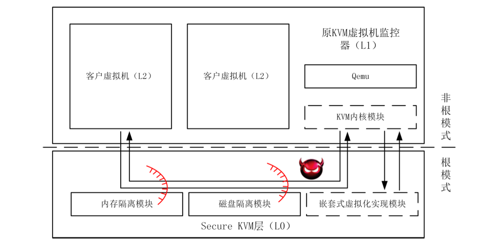

# SJTU的二进制翻译研究总结

自从2007年实现了CrossBit后，在此基础上进行了若干研究，包括优化、安全、不同形态的翻译器等。

## 安全

Nightingale【2017】memvisor【2012/2014】Multimem【2012】CrossIF【2010】system call check【2009】

## 翻译器

BabelFish【2017】DistriBit【2012/2010】，MTCrossBit【2011/2009/2008】，GXBit【2011/2005】，CacheBit【2009】，vBTrans【2008】Co-design CrossBit【2008】CrossBit【2007】

## 优化

热代码集中【2011/2010】Fast Return【2010/2009】HW-profile【2009】Condition Codes【2009】硬件查找翻译，与执行分离【2009/2008】profile hot path【2008】Code Cache替换【2008】

## 特定问题

大小端【2011】调试Guest【2008】浮点【2008】


# 一个简单的时间列表

2017

- 【安全】Nightingale，针对VM解释器的代码保护方案，用DBT来简化VM
- 【BT】BabelFish，轻量级静态二进制翻译器，将MIPS转换为LLVM-IR

2014

- 【安全】memvisor，对内存进行备份用于恢复，通过静态二进制翻译的方式处理访存来备份

2012

- 【安全】Multimem，同样通过静态二进制翻译器实现备份
- 【安全】Memvisor
- 【BT】DistriBit，分布式的CrossBit，两层TCache设计（全局+本地）

2011

- 【特定问题】针对大小端的处理，两种方式，byte swap 和 address swizzling
- 【优化】执行第一次收集数据，然后静态分析将热代码集中（提高局部性）
- 【BT】MTCrossBit，扩展CrossBit支持多线程，一个执行，一个优化，两个TCache，ASLC机制同步
- 【BT】GXBit，扩展CrossBit进行自动并行化，生成PTX代码来运行在GPU上

2010

- 【优化】热代码集中
- 【优化】跳转分析，Fast Return
- 【安全】基于CrossBit实现CrossIF构建了BufferSageTy，利用污点分析来检测缓冲区溢出
- 【BT】DistriBit，分布式的CrossBit，两层TCache设计（全局+本地），通讯协议C/S架构

2009

- 【BT】CacheBit，支持模拟Cache的行为
- 【优化】Fast Return
- 【BT】MTCrossBit
- 【优化】Profile，硬件计数，软件在block开头写SPC告诉底层硬件
- 【优化】先执行一次收集信息来优化
- 【安全】system call 的规则检测
- 【优化】Condition Codes（块内和块间的 reduction）
- 【优化】硬件实现虚拟机协处理器，进行翻译、查找等工作，软件只负责执行，消除了上下文切换
- 【BT】中间表示的设计，参考了LLVA和VCODE

2008

- 【BT】早期的MTCrossBit
- 【特定问题】支持DBT的调试器，在中间语言中新增Break指令来添加断点
- 【优化】多种热路径识别算法
- 【特定问题】支持浮点运算，添加中间语言指令
- 【优化】多种不同的Code Cache替换算法分析
- 【BT】vBTrans，在XEN中运行IA32EL，添加MMU、中断、IO的处理，支持系统态
- 【BT】Co-design CrossBit，硬件翻译、查找，执行与翻译分离（09年那篇的前身？）

2007

- 【优化】可加载的优化器，中间语言层面的优化
- 【BT】CrossBit


# 文章简析


## 2017 Nightingale: Translating Embedded VM Code in x86 BInary Executables

研究了基于VM解释执行的代码保护方式，并提出了一个二进制翻译工具来简化（优化）嵌入其中的那个VM。

- In this paper we study the VM based obfuscation and propose a binary translation approach to simplify the embedded VM stub in a host program
  - NIGHTINGALE
    - an execution trace recording module (Intel PIN)
    - an offline program analysis module (Python)
    - a code patching module (Intel PIN)

- code protection: language embeddeding
  - customized form and embedded VM to execute it


- analysis a VM obfuscated executable
  - need to analyze the VM interpreter
  - (1) recover the structure of the used VM
    - the fetch/decode/execute loop
    - the instruction buffer
  - (2) then understand the obfuscated code
  - to conduct an embedded language disassembling to help understand it
- **ASSUMPTION**
  - each handler of the embedded languages's VM interpreter could be translated into a set of simple operations in host language


## 2017 针对 MIPS 程序的静态二进制翻译技术研究

- 硕士论文，支叶盛，导师：谷大武
- 针对MIPS程序的轻量级静态二进制翻译系统，BabelFish
  - 将MIPS转换为LLVM-IR表示


- VEX-IR是二进制插桩工具Valgrind的中间语言

对跳转、调用、数据段处理等分析都比较粗糙

（原文中甚至直接把引用文献的题目写进去了，这真的是2017年的毕业论文吗？！）


## 2017 嵌入式设备动态分析方法研究

- 硕士论文，刘穆清，导师：谷大武
- 实现一个跨架构模拟器，解决嵌入式设备的动态分析
  - 在动态链接层面，直接利用本地的动态库
- 提出了针对厂商定制代码的分析方法
- 对国内5个嵌入式设备进行了实际的分析（。。。）


## 2015 虚拟化环境下操作系统安全性和性能的研究

并不是二进制翻译

（1）利用嵌套虚拟化在KVM底下又加了一层，来控制访存和数据加密

（2）用vCPU Ballooning来绑定vCPU到物理核，减少vCPU的数量，降低双重调度问题导致的过高的开销

- 硕士论文，缪天翔，导师：陈海波
- 针对虚拟化环境中的安全性和性能进行研究
- 基于嵌套虚拟化，实现Secure KVM，在原KVM下添加安全嵌套式虚拟化层
  - Secure KVM占据最高权限，原KVM在non-root模式下运行
  - 内存隔离模块：维护L2正常运行，禁止L1访问无关内存
  - 磁盘隔离模块：对L2操作进行加解密，使L1仅能接触加密后的数据



- 在KVM平台上实现了FlexCore，一个虚拟机动态调度系统
  - 利用vCPU Ballooning机制，减少虚拟机的vCPU数量来降低竞争
  - 虚拟化环境下的双重调度现象：真实core和vCPU
    - 锁的性能下降：vCPU进入锁，但在真实core上仍被调度
    - 
    - 
    - VMM调度器不清楚VM中的实际运行状况，导致不友好的调度
  - vCPU-Bal：将双重调度转化成为一层调度（应该是让vCPU独占某个核）
  - Intel的PLE特性：Pause-Loop-Exiting
    - `PLE_Gap` 两条 PAUSE指令间隔的时钟周期数
    - `PLE_Window` 触发vmexit的临界自循环次数
      - 两条pause之间超过了`PLE_Gap` 认为是新的循环开始
      - 若未超过，则计数增加，直到触发 vmexit
    - 一段时间内较高的 PLE 次数，说明大量CPU时间被浪费在忙等待上，且极有可能是由于双重调度的存在而导致的


## 2014 Multi-Granularity Memory Mirroring via Binary Translation in Cloud Environments

- memory errors 内存错误：备份、恢复

> As the size of DRAM memory grows in clusters, **memory errors** are common.
>
> Current memory availability strategies mostly focus on **memory backup** and **error recovery**.

- this paper : memvisor

> In this paper, we present a novel system called Memvisor to provide high availability memory mirroring.
>
> It is a **software approach** achieving flexible multi-granularity memory mirroring **based on virtualization and binary translation**.
>
> (1) flexibly set memory areas to be mirrored or not from process level to the whole user mode applications.
>
> (2) Then, all memory write instructions are duplicated.
>
> - Data written to memory are synchronized to backup space in the instruction level
>
> (3) If memory failures happen, Memvisor will recover the data from the backup space

- static binary translation


## 2012 Multimem: Retrofitting system availability via a lightweight binary translation framework

- 还是 memory failures

> As the size of memory in servers becomes larger and larger, the availability of them is under big pressure as **memory failures** are common.

- 一般来说，如何解决：迁移、容忍、备份

> To improve the memory availability, some solutions try to **mitigate the occurrence of memory errors** while most strategies focus on **memory failure tolerance**.
>
> Hardware solutions like **mirror memory** needs expensive peripheral equipments while existing software approaches are somewhat complicated and limited by the high overhead in practical usage.

- this paper: multimem

> In this paper, we present a novel lightweight binary translation framework called Multimem to improve system memory access availability.
>
> It is a software approach achieving hardware mirror memory feature via **static binary translation** technology.
>
> Multimem switches native systems to high available systems with two or more **copies of memory** so when memory failures happen, systems could **recover** the data from the replica.

- 怎么感觉和 memvisor 一模一样的方法呢，换了个名字？？？


## 2012 Memvisor: Application Level Memory Mirroring via Binary Translation

- 和更上面的一篇一样，只是更早的会议论文


## 2012 面向受限系统的分布式动态二进制翻译的分析与研究

- 博士论文，作者：杨吟冬，指导教师：管海兵
- （1）虚拟中间指令集V-IIS，（其实就是上交的CrossBit）
- （2）分布式动态二进制翻译框架，DistriBit，为瘦客户端服务
- （3）为DistriBit设计的代码缓存管理策略
- （4）优化：虚拟机寄存器数量、热路径块状（云计算虚拟分布式环境）


- CrossBit的优化
  - profile热路径：overhead和performance
  - 寄存器分配：直接分配、点对点、全局、next-use
  - 软硬件协同：Hardware(Transaltion, TCache Lookup) / Software(Execute)
- 高效适应性虚拟中间指令集 V-IIS


- 两级代码缓存管理策略
  - 客户端本地的TCache缓存：L1（热代码、超级块）L2（冷代码）
  - 全局代码TCache管理


## 2011 Flexible Endian Adjustment for Cross Architecture Binary Translation

- 关于大小端的问题，虽然是inconspicuous（不明显的），但是也会导致性能瓶颈

> The issue is inconspicuous but may lead to significant performance bottleneck.

- 研究了两种不同的方式：byte swap和address swizzling

> This paper investigates the key aspects of endianness and finds several solutions to endian adjustment for cross-architecture binary translation.
>
> In particular, it considers the two principal methods of this field — byte swapping and address swizzling, and gives a comparison of them in our DBT (Dynamic Binary Translator) CrossBit.

- Address Swizzled：进行地址转换，来适配host的大小端（一切均采用了host的大小端，仅修改访存地址）
  - 初始数据如何处理？数据段仍然按照guest的大小端存储？🤔

> Swizzled address = HighWMark − (SIZE + EA − LowWMark)

```markdown
0. little-endian guest and big-endian host
1. store 0x2000 4Bytes 0xABCD
store address = 0x2004 - (4 + 0x2000 - 0x2000) = 0x2000
//         0x2000, 0x2001, 0x2002, 0x2003
// little:      A,      B,      C,      D
// big   :      D,      C,      B,      A  // 直接按照host的进行写入，在host看来是0xABCD，在guest看来是0xDCBA
2. load 0x2002 2Bytes
load  address = 0x2004 - (2 + 0x2002 - 0x2000) = 0x2000 // 地址转换
load  value   = 0xCD // 直接按照host的进行读取，得到正确的数据
```

- Byte Swap：总是进行转换

```markdown
0. little-endian guest and big-endian host
1. store 0x2000 4Bytes 0xABCD => 0xDCBA
//         0x2000, 0x2001, 0x2002, 0x2003
// little:      D,      C,      B,      A  // host数据，在host看来存储的是0xDCBA
// big   :      A,      B,      C,      D
2. load 0x2002 2Bytes
load  value   = 0xDC // 按照host的大端读取
byte swapping = 0xCD // 得到正确数据
```

- 好像进行地址转换的性能会好一些


## 2011 A Dynamic-Static Combined Code Layout Reorganization Approach for Dynamic Binary Translation

- 一作：管海兵
- 把hot code放在software cache的开头，集中起来，提高locality

> In the static phase, based on the profile information collected in the previous stage, we first use the method of code replicating to build the traces, and then reorganize the layout of the target code by **putting the hottest traces at the top of the software cache**.


- 好像测试部分不太对劲啊，图画错了吧，这性能都下降接近一半了。。。。


## 2011 MTCrossBit: A dynamic binary translation system based on multithreaded optimization

- 一作：管海兵
- 大部分都是单线程，我们搞出来一个多线程的，用一个线程负责优化

> We propose a **multithreaded** DBT framework with no associated hardware called the MTCrossBit, where a **helper thread for building a hot trace** is employed to significantly reduce the overhead.

- 两个机制

> the dual-special-parallel translation caches and
>
> the new lock-free threads communication mechanism—assembly language communication (ASLC).

- 前者就是两个cache分开（TCache和SuperBlockCache）来避免多线程的竞争
- 后者就是，用汇编语言（host二进制吧）来读写一个counter进行同步。嗯，就是这样。

这英文写得太难受了，读起来也难受......


## 2011 CPU/GPU异构多核虚拟执行环境框架的设计与实现

- 硕士论文，肖汉波，导师：梁阿磊
- Crossbit来进行自动并行化，从而利用GPU的强大并行处理能力，避免重写源代码的复杂性
- GXBit：分析 :heavy_plus_sign: 执行，静态:heavy_plus_sign: 动态
  - 扩展了Crossbit的中间指令
  - 识别循环，构建空间多面体，检测可并行执行的部分
  - PTX代码生成、加载、执行


- 测试程序：矩阵乘、快速傅立叶变换、Parboil测试套件（MRI-FHD和MRI-Q）


## 2011 基于虚拟机 QEMU 的嵌入式全系统仿真测试环境的研究与实现

- 硕士论文，鲍颖力，导师：余松煜、倪红英

哇正文读不下去，看个题目就好了。。。


## 2010 A New Approach to Reorganize Code Layout of Software Caceh in Dynamic Binary Translator

- Yunchao He, Kai Chen, Jinghui Gu, Haipeng Deng, Alei Liang, **Haibing Guan**

- 识别出Code Cache中热代码，聚集到一起，提高局部性（没错和之前的一篇一样）

> In this paper, we designed a new approach using dynamic-static combined framework to reorganize code layout of software cache.

- OCL: Ordered Code Layout（本文的方式，先拿到profile信息，然后根据热度排序来加载）
- RCL: Raw Code Layout（原始的方式，默认按照翻译的顺序）
- PCL: Partitioned Code Layout（超级块的方式，两个code cache）


## 2010 The Optimizations in Dynamic Binary Translation

- **Haibing Guan**, Hongbo Yang, Zhengwei, Qi, Yingdong Yang, Bo Liu

> This paper investigates a few optimizations to alleviate the overhead in DBT.
>
> We evaluate these optimizations in **CrossBit**, which is a resourceable and retargetable dynamic binary translator, including block **linking**, **condition codes** optimization, **register mapping** optimization, **static-integrated optimization**, **multithreaded** optimization.


## 2010 动态二进制翻译中跳转分析与优化

- 硕士论文，孙廷韬，导师：管海兵
- 分析跳转数据，实现inline，hash table，return cache等跳转优化


- Fast Return 机制

> 源程序的返回地址直接替换成对应的翻译后块的地址


## 2010 基于动态二进制探测框架的缓冲区溢出检测研究

- 硕士论文，宋奕青，导师：邹恒明
- 以动态二进制探测方法和污点分析方法为指导，基于Crossbit构建来CrossIF，实现了BufferSafeTy
- 污点分析 Taint Analysis
  - 对程序使用的数据进行分析，将其标记为被污染的（tainted）和干净的（clean）两类
  - 在程序执行过程中控制污染属性的传递
  - 当非法使用被污染数据时，可以断言攻击行为的存在
  - 静态污点分析：嵌入源代码的类型分析中，通过编译器获取类型信息，完成污染属性传播
  - 动态污点分析：跟踪变量、存储单元、寄存器，检测污染数据的非法使用


## 2010 用于受限系统的分布式动态二进制翻译框架的设计与实现

2012年也有一篇呀，同一个导师哎，怎么回事呢

- 硕士论文，褚超，导师：管海兵
- 基于Crossbit研究一种基于C/S架构的分布式动态二进制翻译框架
- （1）通讯协议的设计（2）服务端/客户端设计（3）两层TCache设计（4）性能评估


## 2009 The Implementation of Dynamic linking in Dynamic Binary Translation System

- Song Yiqing, He Yuemei, Liang Alei, **Guan Haibing**
- 基于CrossBit，实现DBT支持动态链接（应该是直接调用本地动态库）
- （1）Dynamic Loading：加载动态库到内存中
- （2）Dynamic Resolving：计算function的真实地址
- （3）Function Wrap：构建参数，调用function，并正确设置好返回值


## 2009 CacheBit: A Multisource-Multitarget Cache Instrumentation Tool

- Chao Xu, Jinghui Gu, Ling Lin, Alei Liang, **Haibing Guan**
- 一个插桩工具Cachebit，基于Crossbit

> Cachebit **simulates cache behavior** and presents statistics of cache profile at runtime.
>
> After running programs on Crossbit with Cachebit available, cache profile information can be reported to help developers rewrite and improve their programs.

也就是模拟了cache的行为呗，基于DBT就可以拿到所有的访存行为

我的评价是：不如收集trace并分析来得更容易，但模拟cache行为可以提供更大的能力


## 2009 Return Instruction Analysis and Optimization in Dynamic Binary Translation

- Sun Tingtao, Yang Yindong, Yang Hongbo, **Guan Haibing**, Liang Alei

> In this paper, we present an improved **return cache** scheme with relative low overhead to handle the return instruction, the most important form of indirect branch.


## 2009 MTCrossBit: A Dynamic Binary Translation System Using Multithreaded Optimization Framework

- Xiaolong Li, Deen Zheng, Ruhui Ma, Alei Liang, and **Haibing Guan**
- 会议ICA3PP
- 和2011的内容一样：分开的Cache :heavy_plus_sign: 汇编的同步ASLC


## 2009 A Runtime Profile Method for Dynamic Binary Translation Using Hardware-Support Technique

- **Haibing Guan**, Huibing Yang, Bo Liu, Alei Liang, Liang Liu, Ying Chen
- hardware profile很精确但是overhead很大，我们提出了一个DBT和hardware结合的方法

> In this paper, we propose a novel profile approach on DBT using hardware support technique to achieve rapidly and accurately collecting profile information with minimal runtime overhead.
>
> This approach makes use of **instrumentation code** and a set of profiling hardware which supports operations of updating **counters**.


- 在每个选中的block的开始处插入一条特殊的store指令

> The Store instruction is used to pass the first SPC of each block to the FIFO buffer.

- 硬件负责计数


与之前的一个想法类型：在内存条上插入FPGA来截获store和load来进行额外的运算，可以用来计数发现热点


## 2009 The Implementation of Static-integrated Optimization Framework for Dynamic Binary Translation

- Jinghui Gu, Chao Xu, Ling Lin, Juyu Zheng, Kai Chen, **Haibing Guan**
- 动态二进制翻译中**差劲**的profile信息限制了优化的空间，而结合静态分析就可以提升很多

> In traditional Dynamic binary translation (DBT) systems, poor profile information at runtime limits the manner of optimization.
>
> Combining dynamic binary translation with static analysis brings an opportunity to improve the runtime performance.

- 首先执行一次来收集动态信息

> Optimization on the target code is mainly based on the profile information collected from the first execution.

这么搞基本没什么意思了，而且只得到了5%的性能提升


## 2009 A Heuristic Policy-based System Call Interposition in Dynamic Binary Translation

- Deen Zheng, Zhengwei Qi, Alei Liang, Hongbo Yang, **Haibing Guan**, Liang Liu
- 跨架构的安全问题，处理 malicious programs 即恶意程序

> In this paper, we present HPSCIBit, a solution that efficiently confines malicious applications, supports **automatic policy generation** and **interactive policy generation**, **intrusion detection and prevention** in the DBT system.
>
> 入侵的检测和防护


- 核心似乎是一个`System Call Interposition Module` 
- 使用了 `Systrace-like pllicy language` 来构建安全规则

```
N. Provos, "Improving Host Security with System Call Policies," In Proc. 12th USENIX security Symp., pp. 257-272,2003
```


看上去是一些非常简单直白的规则来保护系统


## 2009 A Two-Phase Optimization Approach for Condition Codes in a Machine Adaptable Dynamic Binary Translator

- Chu Chao, Zheng Juyu, **Guan Haibing**, Liang Alei
- 首先进行块内的 Flag Reduction

> First, redundant flag computing code in a basic block is reduced based on the information collected by Crossbit when the block is identified.

- 然后进行延迟的校验

> Then, lazy evaluation technique is used inter basic blocks, which make the condition codes emulation more efficient.

- 减少了大概 37% 的 native codes


## 2009 跳转链接技术在动态二进制翻译中的应用

- 潘丽君，姜玲燕，上海交通大学软件学院硕士，*微型电脑应用*
- 介绍了几种跳转链接，然后说Crossbit用了这些技术。（就这）


## 2009 虚拟机的软硬件协同设计方法研究

- 硕士论文， 李庭涛，导师：梁阿磊
- 硬件加速的二进制翻译器，依然是基于Crossbit（似乎还是用户级而已）

> 采用FPGA实现了虚拟机协处理器（包括二进制翻译器以及TCache等部件单元）

- 分离执行和翻译，消除上下文切换，硬件单元减少了TCache的查询时间


确认是用户态的二进制翻译了，可以见原文第四章的图


## 2009 动态二进制翻译中的中间表示

- 姜玲燕，梁阿磊，**管海兵**；上海交通大学软件学院；*计算机工程*
- 设计了VINST，参考了LLVA和VCODE

```
[6] Adve V, Lattner C, Brukman M, et al. LLVA: A Low-level Virtual Instruction Set Architecture[C]//Proceedings of the 36th Annual IEEE/ACM International Symposium on Microarchitecture. San Diego, California, USA: [s. n.], 2003.
[7] Engler D R. VCODE: A Retargetable, Extensible, Very Fast Dynamic Code Generation System[C]//Proc. of ACM Conf. on Programming Language Design and Implementation. New York, USA: [s. n.], 1996.
```

- SSA形式化和冗余指令删除
- 在CrossBit上实现，测试了SPEC2000的部分benchmark（为什么不是全部）


## 2009 动态二进制翻译中的热路径优化

- 硕士论文，胡坤，导师：**管海兵**

- 热路径识别 + 超级块生成 + 中间语言优化


## 2008 Multithreaded optimizing technique for dynamic binary translator CrossBit

- **Haibing Guan**, Bo Liu, Tingtao Li, Alei Liang
- 也就是分离了Translation和Execution吧，和2009还有2011的两篇一样的


## 2008 动态二进制翻译中的调试器研究

- 硕士论文，郑举育，导师：步丰林

- 传统调试器无法调试被动态二进制翻译的指令
- 传统调试器的架构


- 在中间语言添加一条BREAK指令来实现断点功能


## 2008 IA64体系结构下虚拟化IA32内存管理单元

- 硕士论文，邢冲，导师：付宇卓
- 系统级二进制翻译对内存的模拟（实现，而不是优化）
- 跨页：禁止跨页跳转，或在进程切换的时候断开所有的跨页跳转
- SMC：通过TLB的表项控制，被翻译过的页将是只读

基本和QEMU的方法一致


## 2008 动态二进制翻译中基于 profile 的优化算法研究

- 硕士论文，史辉辉，导师：管海兵

- 程序运行时的 profile，热代码的识别和优化，以及 基于 profile 信息的代码 cache 管理。

- 提出了一种高效的基于路径的profile方法

  - 基于块、基于边、基于一条路径

  - edge profiling，沿着频率更高的边延伸即可【16%开销】

  - path profiling[36] 函数内的无环正向路径，以回边或返回作为结尾【30%开销】

  - ```
    [36] Thomas Ball, James R. Larus, “Efficient Path Profiling”, 29th Annual IEEE/ACM International Symposium on Microarchitecture, p. 46, 1996.
    ```

  - NET：在降低开销的前提下，实现与path profiling接近的效果

    - 仅计数路径头，达到阈值后记录这一瞬间从该路径头开始的一条路径（瞬间状态）

  - 本文：对路径进行二进制编码，对于热度相近的路径，提取出公共的热块进行超级块优化

- code cache管理：提出了多层次cache，按照profile的热度信息存储，减少碎片和替换


## 2008 可重定向动态二进制翻译器中浮点运算单元的设计与实现

- 硕士论文，秦鹏，导师：步丰林
- 对CrossBit添加浮点运算的支持
- Guest是SimpleScalar，翻译到CrossBit的中间指令，最终生成x87的浮点指令
- SimpleScalar[5] 是一个仿真平台，可执行文件格式为ECOFF

```
[5] D. Burger, T.M. Austin, and S. Bennett, Evaluating Future Microprocessors: The SimpleScalar Tool Set, Tech. Rep. CS-TR96-1308, Univ. Wisconsin, Madison, 1996.
```


## 2008 动态二进制翻译中的TCache替换算法

- 马舒兰，*计算机应用与软件*
- 介绍了不同的Code Cache替换算法
- 结论：粒度适中的粗粒度的FIFO算法综合性能最好，结合了全清空和先进先出的优点

2002年就被测试过了吧...结论也一致


## 2008 基于动态二进制翻译的操作系统虚拟化研究

- 硕士论文，龙开文，导师：付宇卓
- DBT实现完全虚拟化的虚拟机管理器vBtrans，可在Itanium（IA64）上运行IA32操作系统
- vBtrans：结合XEN和应用级二进制翻译器IA32-EL
- 采用松耦合的方式，把IA32-EL运行在由XEN虚拟化出IA64环境中，支持IA32的操作系统运行


- 主要涉及了MMU和TLB、中断的模拟、IO的模拟

  - 内存：遍历IA32的页表，添加到身为host的IA64的TLB中，支持IA32的访存

  - > vBtrans中禁 用了VHPT，并且在物理模式下已经在TLB中建立好了以下三类地址空间的虚实地址映射
    >
    > 1. vBtrans的代码和数据，包括堆栈空间
    > 2. vBtrans的堆空间，存放翻译生成的代码
    > 3. vBtrans对IA-32物理地址的影子映射，包括RAM和PIO,MMIO空间

  - 中断：模拟IA32的中断提交过程

  - IO：模拟IN/OUT和MMIO

  - > 生成的模拟IN/OUT指令功能的代码，通过一般的访存指令LD/ST 来读取I/O地址，当发生TLB miss时，计算出正确的地址填入即可
    >
    > 不将MMIO空间放入TLB，从而拦截所有的MMIO请求

- 优化：物理地址索引的翻译块、适应MMIO的翻译方式


## 2008 基于软硬件协同设计的虚拟机的并行性研究

- 硕士论文，刘博，导师：梁阿磊
- 提出了并行动态二进制翻译模型。(执行与翻译/优化分离，而且都是硬件实现)

> 并行系统通过将动态二进制翻译的任务分配 到两个处理核上执行，将代码翻译 、profile 信息收集、缓存维护、 源-目标执行代码入口地址等任务从二进制翻译器中源结构指令 执行的关键路径上分离出来，提高系统的性能与实时性。

- 硬件翻译、管理TCache、实现部分优化

> 硬件翻译单元主要具备动态二进制翻译，TCache 管理功能以及部分优化机制 的实现等功能。


- Co-design CrossBit 系统的总体结构

> 软件层包括 IA-32 可执行文件的加载器和虚拟 机 IP 核驱动程序以及 Linux 操作系统。
>
> 硬件部分包括 PowerPC 处理器、内存和虚拟机 IP 核。
>
> > 其中虚拟机的 IP 核主要由两部分组成：二进制翻译器和 TCache 管理器。
>
> 软件与硬件之间的通信问题由共享存储的方式解决。

- 硬件上微码实现解释执行的支持

> 软硬件协同设计虚拟机使用微代码实现解释器

- 硬件profile

> 硬件 profile 还 为动态翻译中基本块的生成和选取提供路径描述符，执行计数和指令块大小等数 据支持。优化器还可以根据探测到的指令模式调整 TCache 中热点路径的产生和 监测方式。

- 软硬件协同平台的并行翻译优化模型


## 2007 An Intermediate Language Level Optimization Framework for Dynamic Binary Translation

- Huihui Shi, Yi Wang, **Haibing Guan**, Alei Liang

> The framework proposed in this paper includes efficient **profiling**, **hot code** recognition and smart **code cache** management policies.

- 优化器是可加载的模块

> An optimizer is a loadable tool that coexists with other components in the middle layer of the dynamic binary translation system.


## 2007 二进制翻译系统 QEMU 的优化技术

- 硕士论文，吴浩，导师：李晓勇

- 嗯，研究了一下QEMU

> 本文的主要贡献为研究了目前二进制翻译领域的典型翻译系统，详细研究了 动态二进制翻译系统QEMU的翻译机制、运行方式、翻译策略，并使用其用户级系 统作为我们的实验平台。

- 测试了寄存器分配：ARM(guest) to X86(host)

> 针对QEMU动态二进制翻译系 统中将中间变量映射到宿主机寄存器上的翻译机制，对寄存器的不同映射方案进 行了性能测试。发现了在目前翻译机制下，中间变量的确是使用最为频繁，最有 价值映射的部分。最后提出了取消中间变量的新翻译机制设想。

- 发现了基本块相互覆盖的情况

> 针对QEMU动态二 进制翻译系统中每个基本块以头指令pc作为唯一标识的方式，发现了基本块覆盖 的存在。即基本块可能是某个基本块的一部分，也有可能包括一些基本块。对此 提出了减少基本块覆盖现象的方案，并且将其实现。


## 2007 构建基于动态二进制翻译技术的进程虚拟机

- 硕士论文，包云程，导师：陈英
- 设计了CrossBit，将 SimpleScalar 程序运行在 x86 物理机器上

> CrossBit 的设计目标是可重定向和可扩展。实现可重定向的关键 在于中间指令集 VInst。


- LLVA（Low-Level Virtual Instruction Set Architecture）[29]是一种为代码全生 命期（包括编译、链接、运行时）优化设计的虚拟机器指令集，其特点是在低级 别的虚拟机器指令中包含了优化算法所需要的控制流、数据流和数据依赖等高级 别信息，这些语义信息在一般的物理机器代码中很难提取出来

```
[29] V. Adve, C. Lattner, M. Brukman, A. Shukla, and B. Gaeke, LLVA: A Low-level Virtual Instruction Set Architecture, MICRO-36, San Diego, California, 2003.
```


## 2005 GXBIT: Combining Polyhedral Model with Dynamic Binary Translation

- Zhang Kang, Zhou Fanfu, Liang ALei
- Analysis + Execution

> Analysis stage uses binary instrumentation and binary analysis to probe potential parallel parts (usually nested loop) of a binary executable and then polyhedral model is employed to detect whether there is data dependence or not among all iterations of a nested loop.

- 2011年有篇硕士论文讲了这个东西，大概就是寻找并行化代码，然后翻译成PTX运行在GPU上


