# 国立台湾大学 National Taiwan University (NTU)

台湾大学（National Taiwan University），简称台大（NTU），成立于1928年，是坐落于中国台湾省台北市的一所研究型公立综合性大学，素有“台湾第一学府”之称。

- 其前身是日本统治时期所建立的“台北帝国大学”，为当时日本建立的九所帝国大学之一。

- 1945年，台湾光复后，改名为“国立台湾大学”。

- 1949年，蒋介石政府迁往台湾后，台大取代了当时尚未在台复校的中央大学，成为了台湾地区教育主管部门资助经费最多的一所大学。 

台湾大学自改制起即以傅斯年校长为代表的自由主义学风著称，其教授、学生与校友皆对当代台湾历史的发展有着莫大影响，校园亦为多次民主运动、学生运动的策源地。其大批毕业生担任了台湾各大行业的领军人物，其中就包括知名校友诺贝尔奖得主李远哲。

 2016年英国QS大学排名中位居全球第68位，亚洲高校第21位，台湾地区第1位，是一所在国际上享有较高学术声誉的大学。 2018年6月6日，QS全球教育集团在伦敦发布了第十五期QS世界大学排名，国立台湾大学排名第72名，上升4名。


## 【2019】Exploiting SIMD asymmetry in Arm-to-X86 dynamic binary translation

- 太长不看版

```markdown
- Guest 的向量寄存器长度小于 Host 的向量寄存器长度，但 Guest 的向量寄存器数量更多，而 Host 的数量更少
- 提出了 saSLP 算法，一方面将 Guest 的短向量合并成 Host 的长向量，另一方面将 Guest 不能向量化的地方进行 Host 的向量化
- （1）对于 Guest 中存在的 “向量化+循环展开” 的模式，可以合成更长的 Host 向量指令进行优化
- （2）进行 Combining Reduction 优化（循环中的累加模式）
- （3）针对（2）中常见的 “indirect load” 的情况，利用 x86 的 gather 指令进行向量化
```

- 关联：[【2017】Exploiting Asymmetric SIMD Register Configurations in ARM-to-x86 Dynamic Binary Translation](#【2017】Exploiting Asymmetric SIMD Register Configurations in ARM-to-x86 Dynamic Binary Translation)
- YuPing Liu (NTU); DingYong Hong and JanJan Wu(台湾中央研究院); ShengYu Fu and **WeiChung Hsu** (NTU)
-  *ACM Transactions on Architecture and Code Optimization* 
- SIMD 的能力不断增加，将应用迁移到其他架构时，面临 **SIMD 架构不同**的问题（寄存器数量、长度，指令功能）

> migrating existing applications to another host ISA that has fewer but longer SIMD registers and more advanced instructions raises the issues of asymmetric SIMD capability.
>
> The growing importance of SIMD has reinforced the need to translate SIMD binaries efficiently.

- 现有的工作并没有解决 **host 相比于 guest 有着更少的寄存器数量、更长的寄存器长度**的问题

> - (Fu et al. 2015;Lietal.2006;Micheletal.2011)
>
> map a guest SIMD register directly to a host register with the same width, and map a guest SIMD instruction to equivalent host instructions that operate on the same number of elements.
>
> - (Hallou et al. 2016, 2015;Hongetal.2016)
>
> use loop vectorization to exploit more parallelism but still map one guest SIMD register to one host SIMD register
>
> - However
>
> existing works fail to address the challenges raised by asymmetric SIMD capability, in which the host may have fewer but longer SIMD registers than the guest.

- 本文设计了一个 DBT 中的 **Spill-Aware Superword Level Parallelism** 算法，一方面将 guest 的向量指令合并成更长的 host 向量指令，另一方面将 guest 不能向量化的地方进行向量化

> Given a guest binary loop that has been optimized according to the width and number of guest SIMD registers, saSLP combines multiple guest SIMD instructions and registers to form a longer one on the host.
>
> In addition, saSLP exploits the host’s advanced SIMD instructions to vectorize loops that cannot be vectorized on the guest.

- 典型编译器的向量优化：如 ARMv8 NEON 使用 16 Byte 寄存器（v0-v4）存放 4 个 float 类型数据，同时进行循环展开

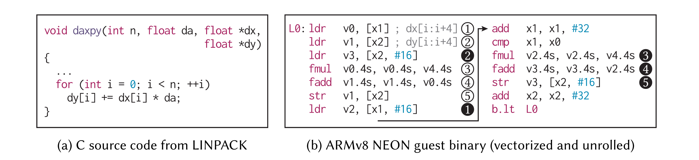

- 在 DBT 的环境下，这种优化后的代码翻译后在 host 并不高效：x86 的 AVX2 更长（32 Byte）但是更少（仅3个）

> As a result, the parallelism that can operate on eight floating-point numbers on the AVX2 host is underutilized.
>
> Furthermore, since the AVX2 host in this case has only three registers, the five overlapping live ranges in Figure 2(c) will cause register spilling

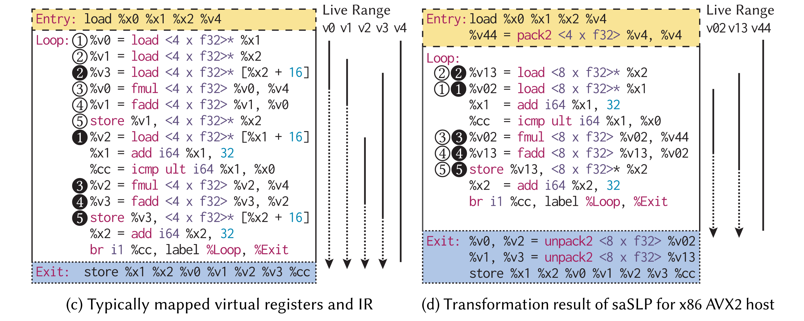

-  **运行时检查** ：Runtime Memory Aliasing Check `to ensure that the combining is valid, saSLP marks reordered memory instructions that can be checked at runtime` 
-  **代价模型** ：Spill-Aware Cost Model `To decide whether combining the grouped short instructions in the combining graph to form long SIMD instructions would be profitable` 
-  **循环中累加的优化** ：Combining Loop Reductions `saSLP also selects a sequence of short (i.e., scalar or vector) reductions as seeds and combines them to form a long SIMD reduction` 

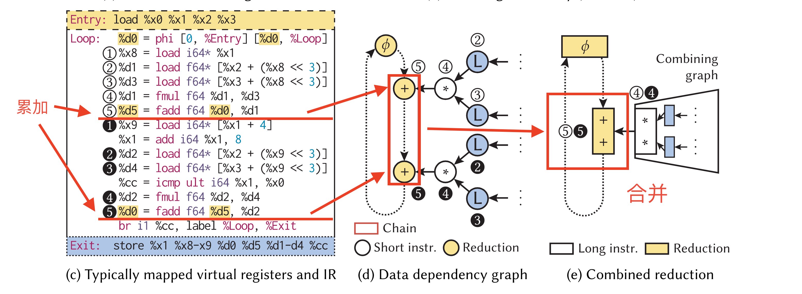

- **间接Load**：上文的累加优化，数据来源中的 indirect load 无法直接被向量化，因此利用了 host 的 gather 指令进行向量化

> Combining Indirect Loads to Form Gather Loads
>
> - 利用 x86 的 gather 指令进行优化
>
> To vectorize data-irregular loops that cannot be vectorized on the guest owing to the indirect array loads, saSLP combines the indirect loads and exploits the **host’s SIMD gather instructions**.
>
> - 针对 “**indirectly load and then accumulate**” 这种 pattern 进行优化
>
> This is a significant issue because the innermost loops in many important applications, such as......, contain “**indirectly load and then accumulate**” pattern and are read-only.

- 性能测试

> We implemented saSLP in **HQEMU** (Hong et al. 2012), a retargetable cross-ISA DBT based on the LLVM 6.0 JIT compiler.
>
> We evaluated saSLP with translations from a guest ISA, **ARMv8 NEON with 32 16B SIMD registers**, to two host ISAs, x86 **AVX2** and **AVX512**.

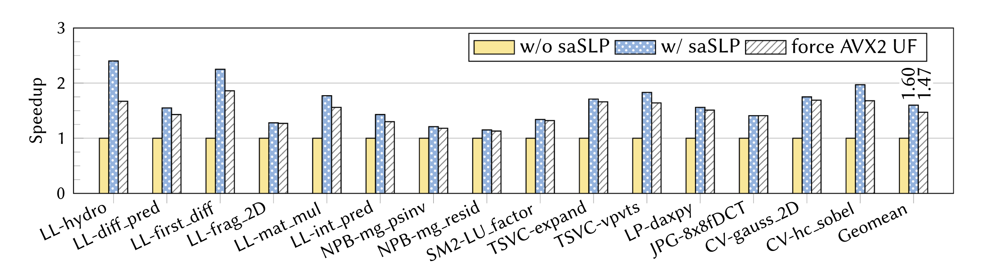


## 【2019】Exploiting Vector Processing in Dynamic Binary Translation

- 太长不看版

```markdown
- 对于标量循环分析，提出了 Virtual Register Promition 方法，处理后可以便于分析其进行分析。
- 但是会带来 Memroy Aliasing 的问题，因此需要进行 Runtime Checking，本文提出了一个高效的 check 方式。
- 这个 Runtime Checking 的优化简单的说就是将多个不同的 Stack 的访存地址范围扩大成连续的一段，来加快地址范围的对比。
```

- ChihMin Lin, Sheng Yu Fu,YuPing Liu, **WeiChung Hsu** (NTU); DingYong Hong, JanJan Wu (台湾中央研究院)
-  **ICPP** *Proceedings of the 48th International Conference on Parallel Processing* 
- 编译器和向量化的发展是趋势，但是老旧的软件无法利用新出现的向量能力。

> Auto vectorization techniques have been adopted by compilers to exploit data-level parallelism in parallel processing for decades.
>
> However, since processor architectures have kept enhancing with new features to improve vector/SIMD performance, **legacy application** binaries failed to fully exploit new vector/SIMD capabilities in modern architectures.

- 研究了DBT中非向量化循环转为向量形式来获得性能提升。

> In this paper, we study the fundamental issues involved in crossISA Dynamic Binary Translation (DBT) to convert non-vectorized loops to vector/SIMD forms to achieve greater computation throughput available in newer processor architectures.
>
> The key idea is to **recover critical loop information** from those application binaries in order to carry out vectorization at runtime.

- 针对二进制的循环分析，Scalar Evolution Analysis

> **Scalar Evolution Analysis** has been adopted in modern compilers (e.g., GCC, LLVM) 
>
> - to understand loop-oriented expressions and 理解循环变量 
> - the changes in the value of scalar variables over iterations of the loop. 标量数据的变化
>
> Such analysis approach is commonly used in 
>
> - loop strength reduction,					降低循环强度（如何理解？比如将乘法变成加法）
> - induction variable simplification,     循环归纳变量简化
> - loop vectorization,                              循环向量化
> - loop access analysis, and                   循环访存分析
> - dependence analysis                          依赖分析

- 有一个大问题：scalar variable 在 DBT 中可能变成了 Memory Reference（由于Register Spilling）

> Scalar variables in binaries may not always be in the form of scalars, but in the form of memory references because of register spilling.

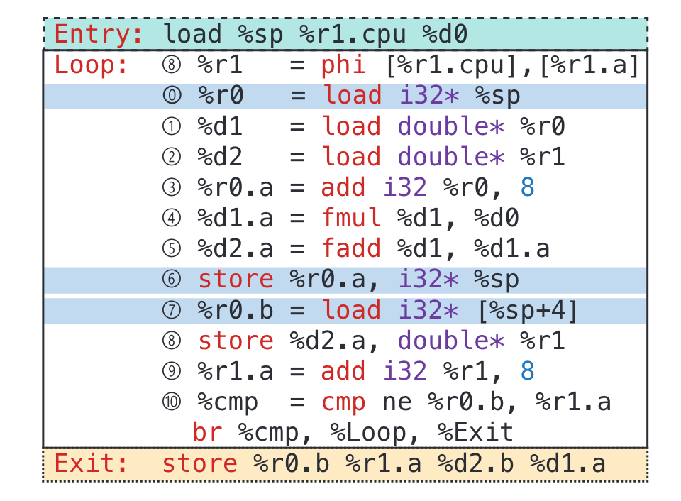

- 对于 `0` `6` `7` 的分析，会被识别为循环中改变的数据，而不是循环的index变量

> [0] [6] [7] would be viewed as loop invariant with memory references to stack instead of an induction variable

- 对于此问题（循环变量在二进制中呈现内存访问的形式）采用 virtual register promotion

> Hence, we adopt virtual register promotion, which promotes spilled variables to virtual registers, to simplify loop analysis and enable vectorizations.

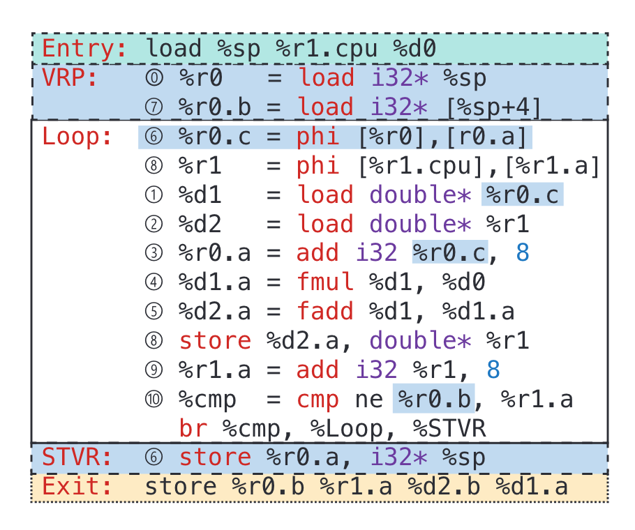

- 但这样就带来了**内存别名**问题

> However, promoting the spilled variables to virtual registers has potential aliasing issues
>
> Spilled variables [0] [6] [7] may alias to memory reference instructions ( [1] , [2] ,and [8] ).

- 我们提出了一个 **Safe** 的 Virtual Register Pormotion 方法

> This paper provides detailed solutions to our safe virtual register promotion approach

- 本文的三点贡献

  - **（1）提出了安全的 Vritual Register Promotion 方法并证明**

  - > First, we address the challenges of virtual register promotion, provide the detailed solution of the problems, and prove the validity of this approach after vectorizing the loops.

  - **（2）提出了一个新的重写循环的方案来提升向量的覆盖范围**

  - > Second, we propose a new approach of loop rewriting to increase the vectorization coverage of binary loop vectorization.

  - **（3）提出了一个运行时检查的办法来确保正确性**

  - > Third, we present a new method of runtime checks to ensure the correctness of code emulation after applying above optimizations and vectorization in DBTs.

- （一）Safe Virtual Register Promotion 主要是内存别名问题，需要运行时检查（如何检查？）

> There are two types of spilled variables. One is **Program Counter (PC) relative data**, and the other one is **stack variable**.
>
> To solve the problems, DBTs should ensure no aliasing between spilled variables and other memory references. 需要确保没有内存别名问题！
>
> runtime aliasing check is required to prove the validity of virtual register promotion before entering the loop with promoted spilled variables. 不得不进行运行时的检查
>
> 一个直白的方式就是在可能有别名的访存指令之前，插入检查代码。但是并不适合向量化的循环，因为向量化会改变访存顺序，而且交织在一起的访存可能会无法恢复。
>
> 还有一个方式就是记录所有的变化，以便于恢复，比如Transmeta。
>
> 还有一个方式，就是在loop之前检查所有的memory aliasing，但是开销会很大。

- 进行 Virtual Register Promotion 的算法

> A spilled variable may be viewed as **a loop invariant stored on the stack**.
>
> DBTs are capable of detecting whether the value of stack pointer is modified in the loop.

- 判断地址别名问题是否存在的条件（比较清晰明了）

  - SS: Spilled Store ; SL: Spilled Load

  - ST: Non-Spilled Store ; SL: Non-Spilled Load

  - A = (SS ∩ (ST ∪ LD)) ∪ (SL ∩ ST ) 为空时，不存在地址别名问题

    - 所有 Spilled Load 与 Non-Spilled Store 的地址不重合

    - 所有 Spilled Store 与 Non-Spilled Load/Store 的地址不重合

  - > Scalar Evolution Analysis can expose loop trip-count and stride distance, DBTs can employ such information to calculate the loop boundary
    >
    > 利用 Scalar Evolution Analysis 得到的信息计算边界

- 由于只考虑 Stack 的访存变量进行 Virtual Register Promotion，即 Stack 访问被视为 Spilled

  - 优化： **将栈的一段连续空间进行 Memory Aliasing Check 从而减小开销** 

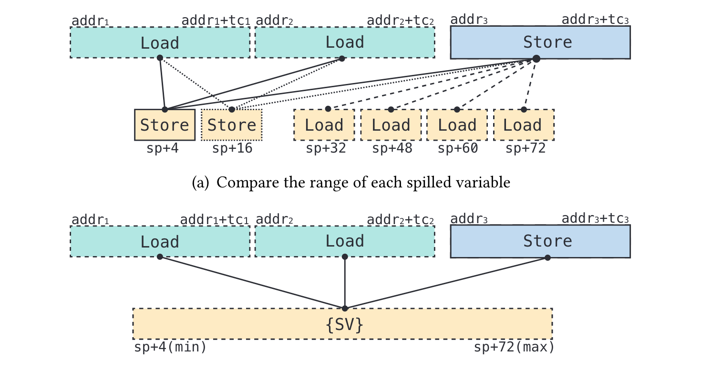

- 除此之外，向量化本身还会带来其他的内存别名问题

> In addition to the issue of spilled variables, vectorizing a binary loop still has other issues of memory aliasing.
>
> 数组访问的相互覆盖问题
>
> DBTs should check the dependency at run time among memory references.

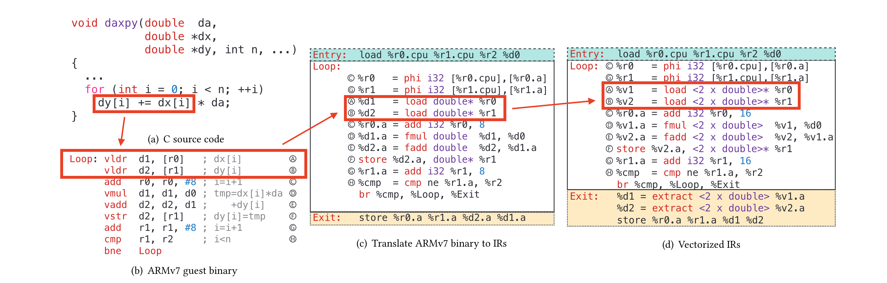

- 因为需要对数组进行向量化，因此需要确保两种内存别名问题不存在：

  - （1）两个数组之间的内存访问不会相互重叠

  - > One is aliasing between memory references with vector operations,

  - （2）循环不变量与其他的内存访问不会相互重叠

  - > the other is aliasing between loop invariants and other memory references.

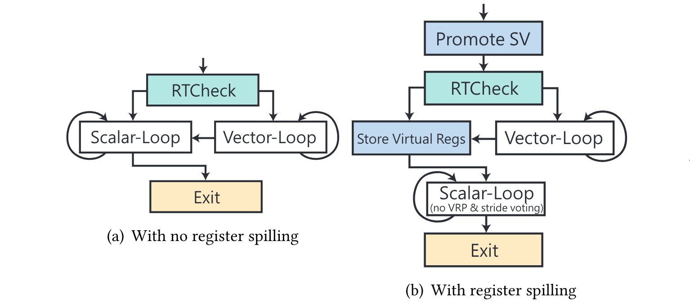

- 实验基于 HQEMU，性能提升大概 40%（但是是如何做到和本地 native 的性能相当呢？DBT本身的开销？）

> We implement our optimization approach in **HQEMU**, a cross-ISA DBT system based on the LLVM 6.0 JIT compiler, and evaluate the effectiveness with **ARMv7 scalar to ARMv8 vector** (NEON with 128-bit SIMD registers) translation with double precision computation.
>
> We select several **benchmark** kernels, in which the time-consuming loops are vectorizable, from various benchmark suites across scientific computing and linear algebra, such as Livermore Loops (LL), PolyBench (POLY), Netlib BLAS (BLAS), SPEC2000, SPEC2006, and SPEC2017 (SPEC), to evaluate the vectorization capability and performance improvement in our DBT.

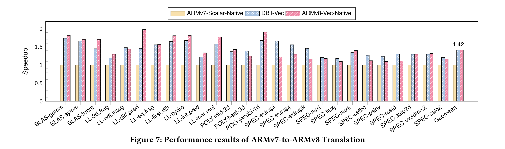


## 【2019】Enhancing transactional memory execution via dynamic binary translation

- 太长不看版

```markdown
- 事务性内存有两种，HLE 和 RTM，前者兼容性好，后者性能高
- 将 HLE 翻译为 RTM 来提高性能，添加了两条 QEMU 的中间指令支持
```

- [1] DingYong Hong,  [4] JanJan Wu (台湾中央研究院) [2] ShihKai Lin, [3] ShengYu Fu, [5] **WeiChung Hsu** (NTU)
- *ACM SIGAPP Applied Computing Review*
- 事务性内存 Transactional Synchronization Extensions (TSX)

>  TSX provides two software programming interfaces: Hardware Lock Elision (**HLE**) and Restricted Transactional Memory (**RTM**). HLE is easy to use and maintains backward compatibility with processors without TSX support, while RTM is more flexible and scalable.
>
> Previous researches have shown that critical sections protected by RTM with a well-designed retry mechanism as its fallback code path can often achieve better performance than HLE.
>
> 好好设计的 RTM 要比 HLE 效率更好

-  **以前用 HLE 写的软件运行在 RTM 上效率其实会更高** 

> More parallel programs may be programmed in HLE, however, using RTM may obtain greater performance.
>
> To embrace both productivity and high performance of parallel programs with TSX, we present a framework built on QEMU that can dynamically transform HLE instructions in an application binary to fragments of RTM codes with adaptive tuning on the fly.

- Hardware Lock Elision 硬件上消除了加锁的操作，复用了前缀，且基于加锁机制，兼容性好，且便于修改

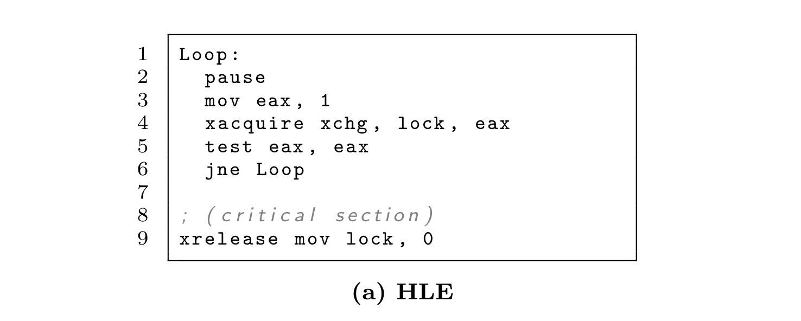

> - 加锁的时候并不真正加锁，而是硬件记录在 elision buffer 中，假装拿到了锁，然后继续执行
>
> The xacquire prefix is the hint to start a transaction and elide the lock. The processor **records the lock’s address and value** in the elision buffer, **pretending the lock is acquired** and **speculatively executing** the critical section.
>
> - 释放的时候进行检查，如果有冲突则 transaction 提交失败
>
> The xrelease prefix is the hint to end a transaction. If data conflicts exist among threads or the lock is not written with the original value recorded in the elision buffer, the transaction is aborted.
>
> - 失败的话从 xacquire 重新执行，但是这次真正地进行加锁操作
>
> Execution restarts from the xacquire-prefixed instruction but ignores the hint this time

- Restricted Transactional Memory 提供了新的指令

> Restricted Transactional Memory (RTM) provides new instructions: **xbegin**, **xend**, and **xabort**, which are used to start, commit and abort a transaction, respectively.

- 翻译：`xacquire` 翻译成 `tm_begin` , `xrealease` 翻译成 `tm_end` ，添加了 QEMU 的中间语言支持
  - 红色：正常的 RTM 路径，进行 begin 和 end 操作
  - 蓝色：RTM 的提交失败后的重新尝试
  - 橙色：嵌套的 RTM，直接忽略 lock 操作而只是记录到 buffer 中即可，释放时仅当 buffer 空才会进行 RTM 的提交
  - 绿色：RTM 失败太多次，回退到普通的 lock 方式

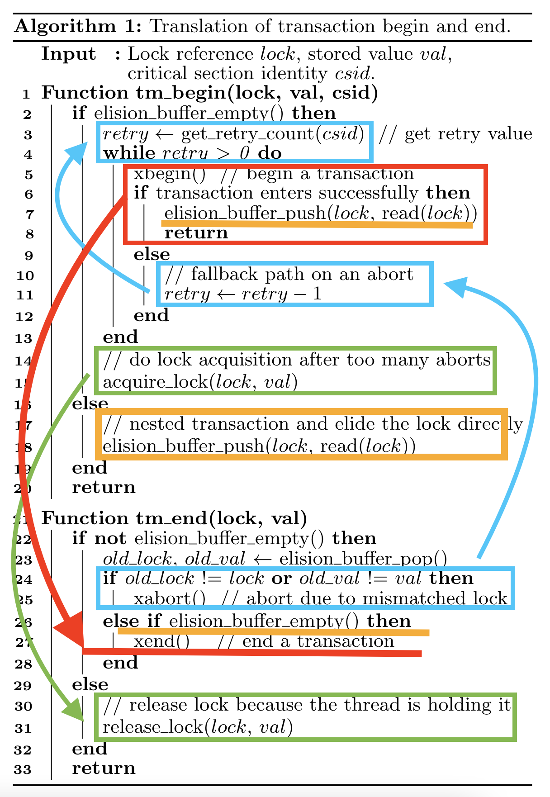

- Adaptive RTM Tuning 自适应的设置 retry 的 count 来调整 RTM 的效率

> Since we have used the retry mechanism to control the execution of RTM transactions, the goal is to determine the retry count that can achieve the optimal transactional commit rate.

- 性能提升还是很明显的

> Our transformation method is implemented in **QEMU** version 2.9.
>
> We evaluate the effectiveness of our transformation using STAMP [23], a benchmark suite designed for evaluating TM system performance.
>
> > STAMP targets a variety of application domains such as machine learning, security, data mining, and scientific computing. It covers a wide range of transaction metrics, including lengths of transactional memory regions, memory usage in transactions, and contention between threads.

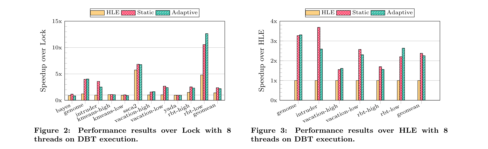


## 【2018】Improving SIMD Parallelism via Dynamic Binary Translation

- 太长不看版

```markdown
- 将 loop 中的 Short-SIMD 翻译成 Long-SIMD 来提升性能。但是本文仅考虑连续访问的 short-SIMD 的优化。
- 由于 long-SIMD 的对齐要求，采用动态“掐头去尾”的访问，满足中部数据访问的对齐要求。
```

- 关联：[【2016】Exploiting Longer SIMD Lanes in Dynamic Binary Translation](#【2016】Exploiting Longer SIMD Lanes in Dynamic Binary Translation)
- [1] DingYong Hong,  [4] JanJan Wu (台湾中央研究院) [2] YuPing Liu, [3] ShengYu Fu, [5] **WeiChung Hsu** (NTU)

- *ACM Transactions on Embedded Computing Systems* 
- SIMD 越来越长，旧软件用不起来

> However, legacy or proprietary applications compiled with **short-SIMD** ISA cannot benefit from the long-SIMD architecture that supports improved parallelism and enhanced vector primitives, resulting in only a small fraction of potential peak performance.

- 提出一种方法**通过 DBT 将 loop 里的 short-SIMD 翻译成 long-SIMD**

> We propose a general approach that translates **loops consisting of short-SIMD** instructions to machine-independent IR, conducts SIMD loop transformation/optimization at this IR level, and finally **translates to long-SIMD instructions**.

- 提出了两种强制 SIMD 进行对齐的解决方法

> Two solutions are presented to enforce SIMD load/store alignment, one for the problem caused by the binary translator’s internal translation condition and one general approach using dynamic loop peeling optimization.

- 已有工作：一种是用标量来模拟，一种是直接使用寄存器映射（浪费了 host 上更大的寄存器宽度）

> This article seeks to exploit full parallelism of longer host SIMD lanes to accelerate the execution of guest SIMD instructions.
>
> We propose a DBT system that enables short-SIMD binaries to exploit long-SIMD architectures by rewriting short-SIMD binary code.
>
> We aim to transform short-SIMD loops into equivalent long-SIMD loops optimized with long-SIMD instructions.
>
> **This work focuses on rewriting loops that consist of short-SIMD instructions**

- 基于 2016 年已有的工作改进而来

> This article extends our previous work (Hong et al. 2016), which focuses on the method of SIMD loop transformation.

```
Ding-Yong Hong, Sheng-Yu Fu, Yu-Ping Liu, Jan-Jan Wu, and Wei-Chung Hsu. 2016. Exploiting longer SIMD lanes in dynamic binary translation. In IEEE International Conference on Parallel and Distributed Systems. 853–860.
```

- 只考虑连续的 SIMD 访存

> The input of SIMD loop transformation is IR of a short-SIMD loop.
>
> We first scan the IR to see if SIMD memory access patterns are **contiguous**. This work only considers contiguous memory accesses and we leave the optimization of non-contiguous memory accesses for future work.
>
> After the IR is verified, the short-SIMD loop IR can be transformed to a long-SIMD loop, though it might not be executed due to violation of memory dependencies.

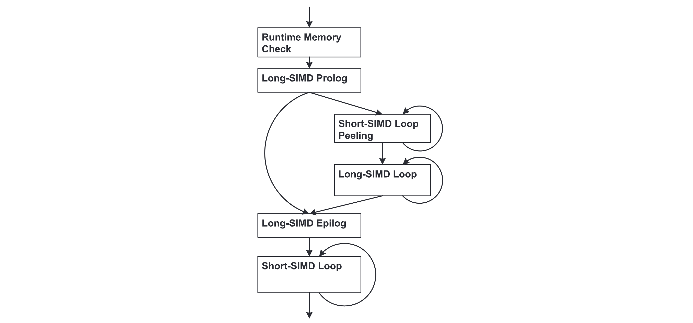

- 向量化后的访存顺序，因此需要进行内存依赖正确性检查：Memory Dependence Check

> Vectorization entails changing the order of operations for the purpose of composing SIMD instructions. Vectorization is only legal if this change of order **does not violate data dependencies**.     不能违反原本的数据依赖关系
>
> vectorizing memory operations can also change the data access order     向量化后的访存也会改变访问顺序
>
> If the distance of a memory reference pair is not computable (...) , this reference pair is recorded and whether p and q have dependence will be checked at runtime.     不能直接判断的地址范围，记录下来进行运行时的判断

- 编译器注释 Compiler Annotation
  - 好像只是提出了这么一种方案，并没有实际实现？

> During SIMD loop transformation, the DBT checks dependence distances between memory references—the same distances that are **also computed by the static compiler but discarded** after the loop is vectorized. It is helpful if the compiler can annotate such calculated results when all dependence distances are compile-time computable.

- 访存的对齐问题 ALIGNMENT PROBLEM

> When running on a longSIMD machine, these data are very likely to be placed at memory locations with original alignment constraints and may not satisfy the alignment constraints of long-SIMD ISAs. 
>
> **按照 short-SIMD 的对齐要求存储的数据可能会违反 long-SIMD 的对齐要求**
>
> - 由于 DBT 天然的分块策略， 会出现 outer-loop 和 inner-loop，使得 inner-loop 从循环的第二次开始执行，导致不对齐
>
> > Such misalignment is caused by code duplication of the inner loop, and it can be overcome by **preventing code duplication**. The solution is to let a DBT stop binary decoding if it tries to decode an inner loop in the middle of a code fragment.
>
> - 比较直白的方式：Dynamic Loop Peeling，掐头去尾，使得中间的数据访问在 long-SIMD 上是对齐的
>
> >  A general solution to enforce the alignment of long-SIMD loads/stores is to **dynamically peel shortSIMD loops** until memory references are aligned with long-SIMD alignment constraints.

- 性能测试

> We evaluate the performance of SIMD loop transformation from one guest ISA, ARM32 NEON, to two long-SIMD host ISAs, x86-64 AVX2 and x86-64 AVX-512.
>
> For comparison, the binary translation without SIMD loop transformation is used as the performance **baseline**, where ARM32 NEON instructions are translated to x86-64 AVX-128 instructions on the host machines.

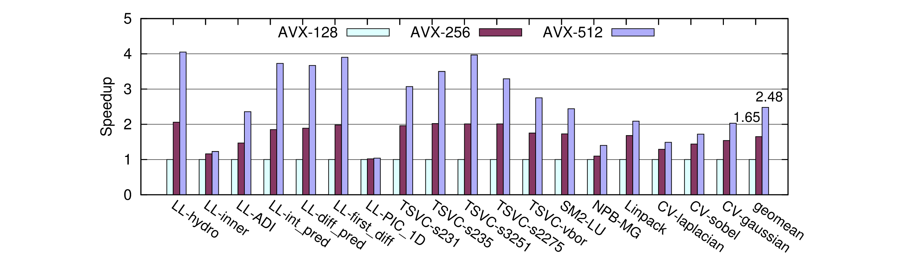


## 【2018】WIP: Exploiting SIMD Capability in an ARMv7-to-ARMv8 Dynamic Binary Translator

- [1] ShenYu Fu, [2] ChihMin Lin, [4] YuPing Liu, [6] WeiChung Hsu (NTU)
- [3] DingYong Hong, [5] JanJan Wu (台湾中央研究院)
- *2018 International Conference on Compilers, Architectures and Synthesis for Embedded Systems (CASES)* 
- 迷你短文，简单讲了这个 DBT

> - Scalar to Vector Transformation
> - Runtime Dependence Checking

- 应该是 `【2019】 Exploiting Vector Processing in Dynamic Binary Translation` 这篇的前身

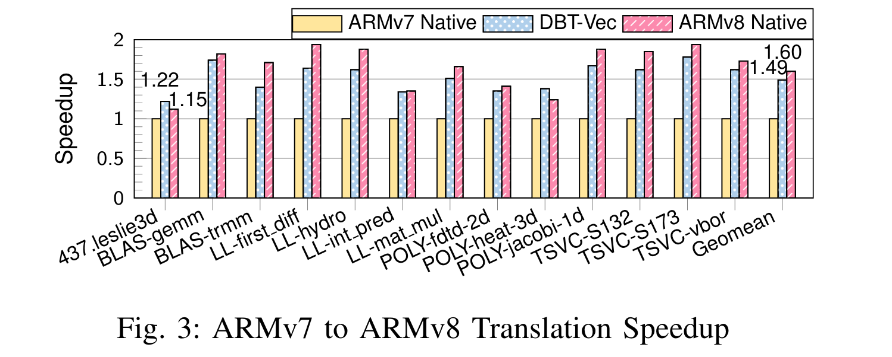


## 【2018】Efficient and retargetable SIMD translation in a dynamic binary translator: Efficient and retargetable SIMD translation in a dynamic binary translator

- 太长不看版

```markdown
- 基于 HQEMU 添加 vector-TCG-IR 进而翻译成 LLVM-IR 并最终翻译成 host 的 SIMD 指令
- 对于不支持的 guest SIMD 指令，调用 helper 进行模拟，但是通过 helper inline 减少了上下文保持/恢复的开销
```

- 关联：[【2015】SIMD Code Translation in an Enhanced HQEMU](#【2015】SIMD Code Translation in an Enhanced HQEMU)
- [1] ShenYu Fu, [3] YuPing Liu, [5] WeiChung Hsu (NTU) ; [2] DingYong Hong [4] JanJan Wu (台湾中央研究院)
- Software: Practice and Experience
- 依然是基于 HQEMU 优化 SIMD 的翻译

> We propose a newly designed **SIMD** translation framework for dynamic binary translation, which takes advantage of the host's SIMD capabilities. The proposed framework has been built in **HQEMU**, an enhanced QEMU with a separate thread for applying LLVM optimizations.

- 添加了 SIMD 相关的 IR

> we propose to enhance the DBT with a well-designed **vector IR** representing the semantics of guest SIMD instructions.

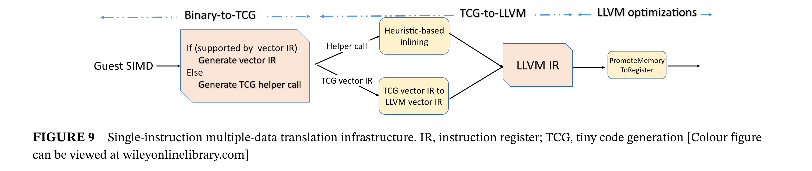

- 因为调用 helper 需要保持/恢复上下文，采用 helper inline 的方式来加速

> Register mapping and redundant state synchronization elimination

- 实验结果：对 IA32 加速平均为 31%，对 ARMv8 加速平均为 35%

> We implement the translation from guest binary to our vector IR in the IA32, ARM-v7, and ARM-v8 frontends. These 3 frontends have the same X86-AVX2 backend since our HQEMU is installed on X86-64 machines.

- 动态指令数量的分布

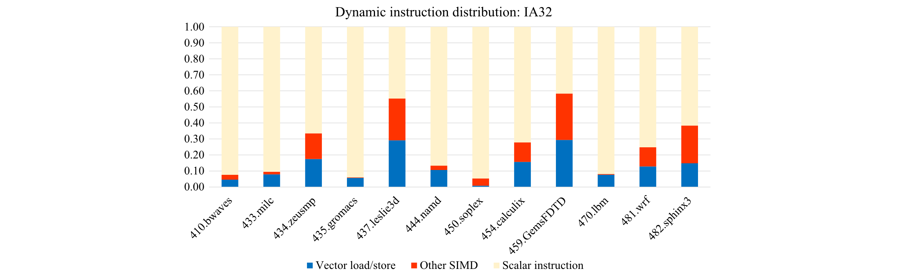

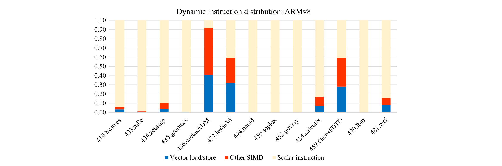


## 【2017】Exploiting Asymmetric SIMD Register Configurations in ARM-to-x86 Dynamic Binary Translation

- [1] YuPing Liu, [4] ShengYu Fu, [5] WeiChung Hsu (NTU) ; [2] DingYong Hong, [3] JanJan Wu
- *2017 26th International Conference on Parallel Architectures and Compilation Techniques (PACT)*
- 其实就是 `[2019] Exploiting SIMD asymmetry in Arm-to-X86 dynamic binary translation` 的会议版
- [【2019】Exploiting SIMD asymmetry in Arm-to-X86 dynamic binary translation](#【2019】Exploiting SIMD asymmetry in Arm-to-X86 dynamic binary translation)


## 【2017】Dynamic Translation of Structured Loads/Stores and Register Mapping for Architectures with SIMD Extensions

- 太长不看版

```markdown
- 面向特殊的 structured load/store 的 SIMD 指令，探索寄存器映射空间，使用 x86 的 gather 指令更好
```

- [1] ShenYu Fu, [3] YuPing Liu, [5] WeiChung Hsu (NTU), [2] DingYong Hong, [4] JanJan Wu (台湾中央研究院)
- *LCTES '17: SIGPLAN/SIGBED Conference on Languages, Compilers and Tools for Embedded Systems 2017*
- 一种特殊的 structed load/store 指令

> Structured loads/stores, such as VLDn/VSTn in ARM NEON, are one type of strided SIMD data access instructions. They are widely used in signal processing, multimedia, mathematical and 2D matrix transposition applications.

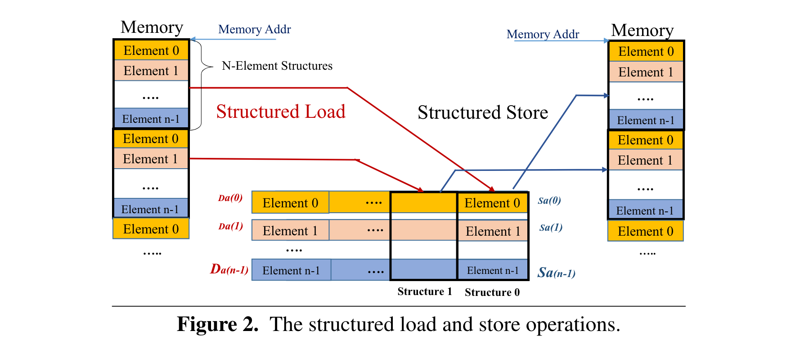

- 四点主要贡献

> 1. 设计了面向 structured SIMD 的 IR 表示
>
> We define and implement a set of generalized pseudo instructions in our DBT IR, which facilitates the translation of SIMD structured loads/stores of arbitrary strides.
>
> 2. 设计了两种寄存器映射方案
>
> We design two register mapping algorithms: one to find the optimal mapping which achieves the best execution performance and one heuristics-based scheme which is much faster in compilation.
>
> 3. 做了实验
>
> Our translation strategy has been implemented on a QEMU+LLVM DBT. Our experimental results on a collection of benchmarks show that our system can achieve a maximum speedup of 5.41x, with an average improvement of 2.93x speedup.
>
> 4. 得到启发
>
> Our arbitrary-stride model for structured loads/stores and its evaluation provide insights and guidelines on how to translate them into different target SIMD instructions.

- 三类不同的翻译方式，用 x86 特殊的 gather 指令最方便

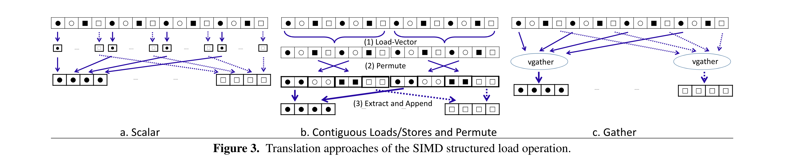

- 根据 guest 和 host 的 SIMD 寄存器宽度，有多种不同的寄存器映射方案
- 实现效果提升明显

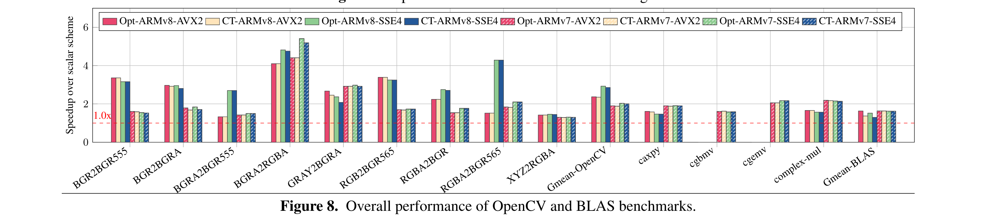


## 【2016】 Optimizing Control Transfer and Memory Virtualization in Full System Emulators

- 太长不看版

```markdown
- 跳转优化主要包括两个：针对 cross-page branch 的优化 iTLB
- SoftTLB 优化主要包括两个：针对大页的部分刷新和动态调整容量
```

- [1] DingYong Hong,  [3] ChengYi Chou ,[6] JanJan Wu (台湾中央研究院)
- [2] ChunChen Hsu, [4] WeiChung Hsu, [5] PangFeng Liu (NTU)
- *ACM Transactions on Architecture and Code Optimization* 

- 就是搞性能 `This paper focuses on optimizing the performance of full system emulators`

> - 优化跳转
>
> First, we optimize performance by enabling classic control transfer optimizations of dynamic binary translation in full system emulation, such as indirect branch target caching and block chaining.
>
> - 优化SoftTLB
>
> Second, we improve the performance of memory virtualization of cross-ISA virtual machines by improving the efficiency of the software translation lookaside buffer (software TLB).

- 跳转优化主要包括两个：针对 cross-page branch 的优化
  - 提出了 iTLB 加快跨页跳转的验证
  - 提出了 Cross-page block linking 对跨页跳转进行链接

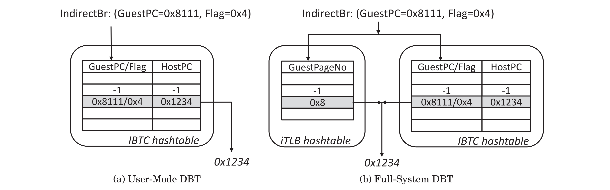

- SoftTLB 优化主要包括两个：部分刷新和动态调整大小
  - 提出了 SoftTLB partial-flush 来追踪大页所占用的 SoftLTB 项，来避免刷新整个 SoftTLB
  - 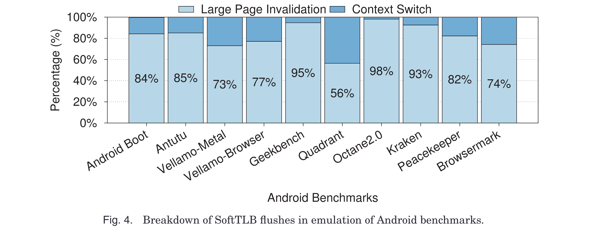
  - 提出了 Dynamically Resizing SoftTLB 来提高命中率、降低刷新开销，进而提高整体性能
  - 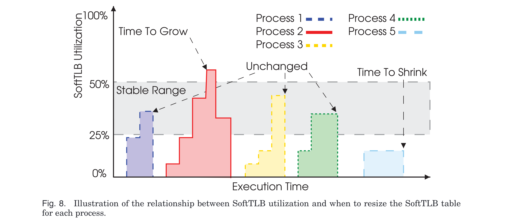


## 【2016】Exploiting Longer SIMD Lanes in Dynamic Binary Translation

- [1] DingYong Hong,  [4] JanJan Wu (台湾中央研究院) [2] ShengYu Fu, [3] YuPing Liu, [5] **WeiChung Hsu** (NTU)
- 后续工作是 `【2018】Improving SIMD Parallelism via Dynamic Binary Translation` 

- [【2018】 Improving SIMD Parallelism via Dynamic Binary Translation](#【2018】Improving SIMD Parallelism via Dynamic Binary Translation)

- 把 short-SIMD 的循环转换为 long-SIMD

> This paper presents a dynamic binary translation technique that enables short-SIMD binaries to exploit the benefits of the new SIMD architecture by rewriting short-SIMD loop code.


## 【2016】 Using Embedded Shadow Page Table to Improve the Performance of QEMU 64-bit Architecture System Emulation

- 太长不看版

```markdown
- 系统态 DBT 采用 ESPT 进行地址翻译加速，两种方式
- （1）当 Guest 只用部分的地址空间时，可以完全通过 ESPT 进行加速优化
- （2）当 Guest 地址空间很大时，通过 profile 分析用到的地址空间，只对其进行 ESPT 的映射
```

- 硕士论文，萧光宏，导师：刘邦锋，吴真贞，国立台湾大学
- 只考虑处理 guest 的部分地址空间

> One possible solution to use ESPT in emulating a 64-bit guest on a 64-bit host is to embed **part** of the guest virtual address space into the host virtual address space, instead of the entire guest virtual address space.

- （一）Restricted Case：实际上 ARM64 只利用了 39 位的地址空间

> Even though Linux now supports 48-bit virtual address space for both of the architectures, current ARM64 Linux (4.6.2) still uses 39-bit virtual address space as the default option.

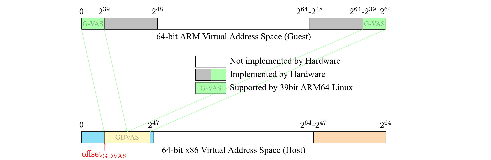

- （二）General Case：仅处理 guest 真正用到的地址空间

> The observation suggests our general case ESPT system to embed those guest virtual address space parts that are **actually accessed by guest** into host virtual address space.

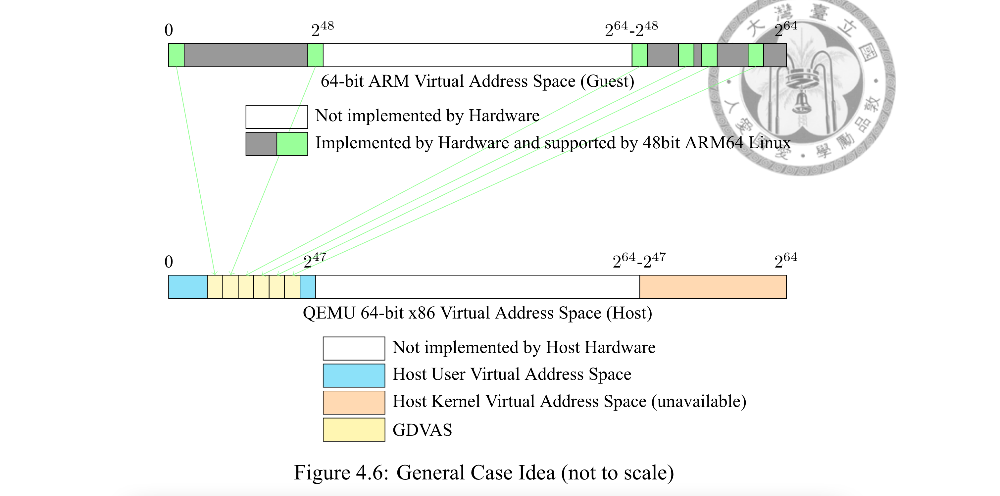

- 仍然先用 SoftTLB 进行查询，但是不把需要映射的放进去，所有会失败，之后用 ESPT 查询

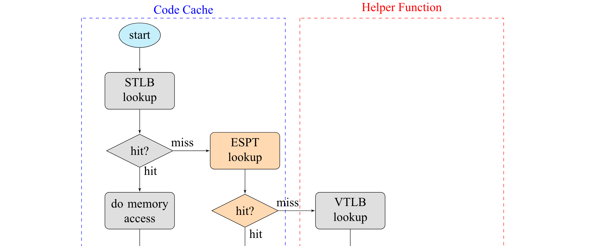


## 【2015】SIMD Code Translation in an Enhanced HQEMU

- [1] ShengYu Fu, [4] PnagFeng Liu, [5] WeiChung Hsu (NTU) ; [2] DingYong Hong, [3] JanJan Wu
-  *2015 IEEE 21st International Conference on Parallel and Distributed Systems (ICPADS)* 
- 就是在 HQEMU 上采用了高效的 SIMD 指令翻译方式

> One weakness of HQEMU lies in the lack of efficient SIMD instruction translation.

- 新增了 TCG Vector IR 并最终生成 LLVM Vector IR 来处理 SIMD 指令

- 和 [【2018】 Efficient and retargetable SIMD translation in a dynamic binary translator: Efficient and retargetable SIMD translation in a dynamic binary translator](#【2018】Efficient and retargetable SIMD translation in a dynamic binary translator: Efficient and retargetable SIMD translation in a dynamic binary translator) 基本一致，不再重复


## 【2015】A dynamic binary translation system in a client/server environment

- 太长不看版

```markdown
- 针对 thin device 的 C/S 架构 DBT 系统
- Server 上进行激进的翻译、优化（使用 LLVM 进行），Client 上进行简单的 DBT 操作（使用 QEMU 的 TCG）
```

- [1] ChunChen Hsu, [3] WeiChung Hsu, [4] PangFeng Liu (NTU) ; [2] DingYong Hong, [5] JanJan Wu (台湾中央研究院)
-  *Journal of Systems Architecture* 
- 说，手机越来越强，甚至可以运行 desktop 应用，比如用 DBT 在 ARM 上运行 IA32 程序，但是性能问题严重
- 网络发展得好，对 thin devices 比较友好，也就给了 DBT 机会，于是设计了一个 C/S 架构的 DBT 系统

> In this work, we looked at those design issues and developed a **distributed DBT** system based on a **client/server** model.
>
> It consists of two dynamic binary translators. 
>
> - An **aggressive dynamic binary translator/optimizer** on the server to service the translation/optimization requests from thin clients, 
> - and a **thin DBT** on each thin client to perform lightweight binary translation and basic emulation functions for its own.

- 三点主要贡献：主要是将更为耗时的翻译、优化放在 server 上进行，client 上只有简单的 DBT 实现

> 1. 设计了 C/S 架构的分布式 DBT
>
> We developed an efficient client/server-based DBT system whose two-translator design can tolerate network disruption and outage for translation/optimization services on a server.
>
> 2. 异步通信机制是可以接受的
>
> We showed that the asynchronous communication scheme can successfully mitigate the translation and optimization overhead and network latency.
>
> 3. SPEC 2006 提升 17%
>
> Experimental results show that the DBT of the client/server model can achieve 37% and 17% improvement over that of non-client/server model for x86/32-to-ARM emulation using MiBench and SPEC CINT2006 benchmarks with test inputs

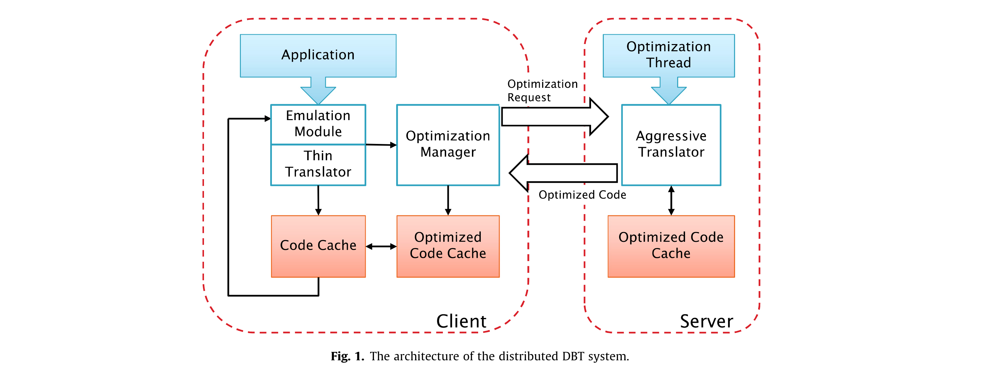

- 使用了 NETPlus 算法

> In this work, we use the NETPlus [11] algorithm to detect the hot code regions and overcome such problems.

```c
[11] D.M. Davis, K. Hazelwood, Improving region selection through loop completion, in: ASPLOS Workshop on Runtime Environments/Systems, Layering, and Virtualized Environments, 2011.
```

- 后台进行的 block link，将优化后的代码链接进去

> After the optimized code is emitted, the un-optimized code is patched and the execution is redirected from the un-optimized codes to the optimized codes. This jump patching is processed **asynchronously** by the optimization manager.

- 实验测试

> All performance evaluation is conducted using an Intel quad-core machine as the server, and an ARM PandaBoard embedded platform [13] as the thin client.
>
> The evaluation is conducted with the x86/32-to-ARM emulation.
>
> We use **TCG of QEMU** version 0.13 as the thin translator on the client side and use the JIT runtime system of **LLVM** version 2.8 as the aggressive translator/optimizer on the server side.

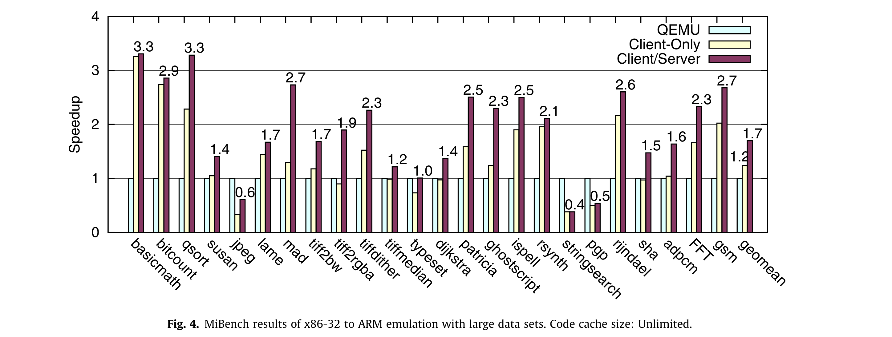

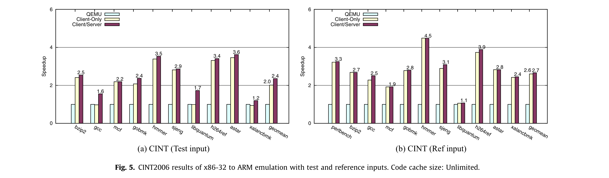

- 也有多线程测试


## 【2014】Efficient and Retargetable Dynamic Binary Translation on Multicores

- 太长不看版本

```markdown
- 设计了多线程的 HQEMU，优化线程 Guest -> TCG IR -> LLVM IR -> Host
- 修改的 NET 算法进行 trace 生成，利用硬件性能监控 HPM 设计了一个 trace merge 的方法
- 针对间接跳转，进行 trace 内部的 inline 检查，失败则 exit 到 IBTC
- 针对原子指令，使用 CAS 替代 QEMU 原本的全局锁的方案
```

- 会议版本：CGO12 [【2012】HQEMU: a multi-threaded and retargetable dynamic binary translator on multicores](#【2012】HQEMU: a multi-threaded and retargetable dynamic binary translator on multicores)
- [1] DingYong Hong, [2] JanJan Wu (台湾中央研究院), [3] WeiChung Hsu, [4] ChunChen Hsu, [5] PangFeng Liu (NTU), [6] YehChing Chung
- *IEEE Transactions on Parallel and Distributed Systems* 
- 著名的 HQEMU，也就是台大后续这一系列工作的基础了

> we demonstrated in a multithreaded DBT prototype, called Hybrid-QEMU (HQEMU)

- 几点主要贡献有：HQEMU、trace算法、IBTC和访存优化	

> 1. 设计了这个多线程的 DBT 系统
>
> We developed a **multithreaded retargetable DBT on muticores** that achieved low translation overhead and good translated code quality on the guest binary applications. We show that this approach can be beneficial to both short- and long-running applications.
>
> 2. 设计了一个新的 trace 算法，利用 on-chip HPM 进行 profile
>
> We propose a novel trace combining technique to improve existing trace formation algorithms. It could effectively combine/merge traces based on the **information provided by the on-chip HPM**. We demonstrate that such feedback-directed trace merging optimization can significantly improve the overall code performance.
>
> 3. 使用了两个优化：IBTC 和轻量级的访存翻译
>
> We use two optimization schemes, **indirect branch translation caching (IBTC)** and **lightweight memory transactions**, to reduce the contention on shared resources when emulating a large number of application threads. We show that these optimizations significantly reduce the emulation overhead of a DBT and make it more scalable.
>
> 4. 开发了 HQEMU 这个原型系统
>
> We built a **HQEMU** prototype, and the experimental results show it could improve the performance by a factor of 2:6 and 4:1 over QEMU for x86 to x86-64 emulation using SPEC CPU2006 integer and floating point benchmarks, respectively.

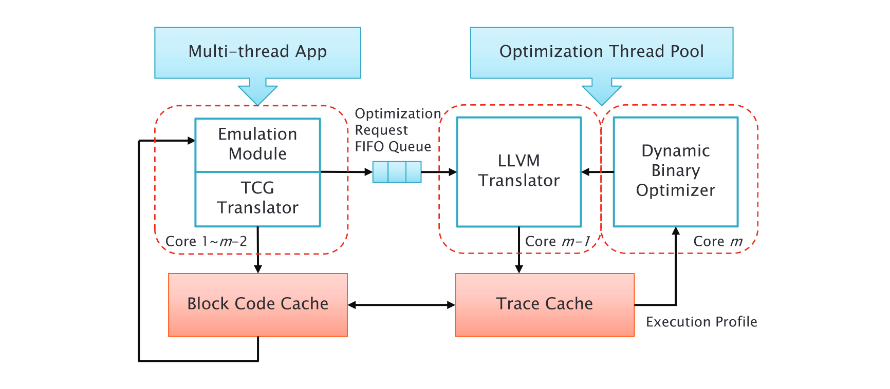

- 放宽松的 trace 算法

> A relaxed version of Next Executing Tail (NET) [5] is chosen as our trace selection algorithm.
>
> In the original NET scheme, it considers every backward branch as an indicator of a cyclic execution path, and terminates the trace formation at such backward branches.
>
> We relax such a backward-branch constraint, and stop trace formation only when the same program counter (PC) is executed again
>
> 和 NET 算法一样仅在 backward branch 处进行 profile，不同的地方在于形成 trace 的时候
>
> - NET 会沿着头节点开始一直往下，一旦遇到 backward 就停止
> - 本文放松了这个限制，仅在遇到（和头节点）相同的 PC 时停止
>   - 即有 backward 但并不是相同 PC 的时候并不会直接停下

```c
[5] E. Duesterwald and V. Bala, “Software Profiling for Hot Path Prediction: Less Is More,” ACM SIGPLAN Notices, vol. 35, pp. 202211, 2000.
```

- 处理间接跳转时候，使用了 IBTC
  - 在 trace 内部首先进行 inline 的 check，如果还在 trace 内则不必 exit，否则跳转到 IBTC
- 原子指令的模拟，默认的全局锁仍然是有问题的

> 1) Wang et al. [10] proved that this approach could still have correctness issues that may cause deadlocks;
> 2) accesses to nonaliased memory locations (e.g., two independent mutex variables in the guest source file) by different threads are serialized because of the same global lock; and
> 3) the performance is poor due to the high cost of the locking mechanism.

- 我们用了另一个方式

> To solve the problems incurred by the global lock, we use lightweight memory transactions proposed in [10] to address the correctness issues, as well as to achieve efficient atomic instruction emulation.

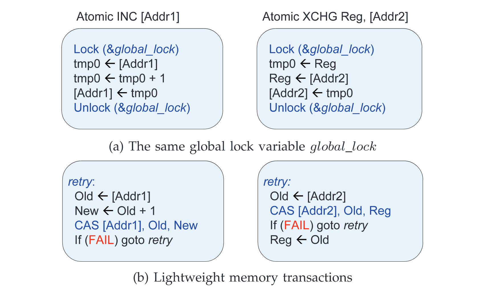


## 【2012】HQEMU: a multi-threaded and retargetable dynamic binary translator on multicores

- [1] DingYong Hong (清华), [2] ChunChen Hsu (NTU), [3] PenChung Yew (Minnesota)
- [4] JanJan Wu (台湾中央研究院), [5] WeiChung Hsu (NCTU), [6] PangFeng Liu (NTU)
- [7] ChienMin Wang (台湾中央研究院), [8] YehChing Chung  (清华)
- *Proceedings of the Tenth International Symposium on Code Generation and Optimization - CGO '12* 
- 期刊版：[【2014】Efficient and Retargetable Dynamic Binary Translation on Multicores](#【2014】Efficient and Retargetable Dynamic Binary Translation on Multicores)


## 【2011】LnQ: Building High Performance Dynamic Binary Translators with Existing Compiler Backends

- 太长不看版

```markdown
- 设计了 retargetable 的 LnQ 即 LLVM + QEMU，替换了 TCG 直接使用 LLVM 进行翻译
- 针对寄存器映射，每个 block 都有独立的 register mapping，需要进行 load 和 store
- 经典优化：Block Link，IBTC，Shadow Stack
```

- [1] ChunChen Hsu, [2]  PangFneg Liu (NTU), [3] ChinMin Wang, [4] JanJan Wu (台湾中央研究院), [5] WeiChung Hsu (NCTU)
- *2011 International Conference on Parallel Processing (ICPP)* 
- LnQ 也就是 LLVM + QEMU

> This paper presents an LLVM+QEMU (LnQ) framework for building high performance and retargetable binary translators with existing compiler modules.
>
> We deisgn the translation module based on LLVM compiler infrastructure, and use QEMU as our emulation engine.

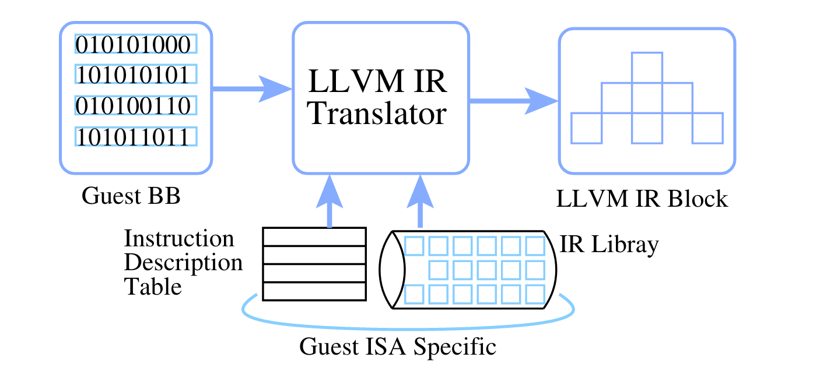

- 运行时优化：Block Link，IBTC，Shadow Stack，


## 【2011】Protection against Buffer Overflow Attacks via Dynamic Binary Translation

- 太长不看版

```markdown
- 在堆上申请空间，插入动态代码，call 时备份 return address 和 frame pointer，然后 return 时进行 check
```

- [1] ChunChung Chen, [2] ShihHao Hung, [3] ChenPang Lee (NTU)
- 利用 DBT 对付 buffer overflow 攻击

> This paper proposes to protect a system from buffer overflow attacks with a mechanism based on dynamic binary translation.

- 动态插入代码保护 return address 和 stack frame pointer

> Our mechanism is capable of recovering corrupted data structures on the stack at runtime by dynamically inserting codes to guard the return address and stack frame pointer, without modification of the source code.

- 在 PIN 和 QEMU 上都实现了

> As a case study, we implemented the proposed protection mechanisms based on Pin [10] and QEMU [1] two popular open-source dynamic binary translation tools.

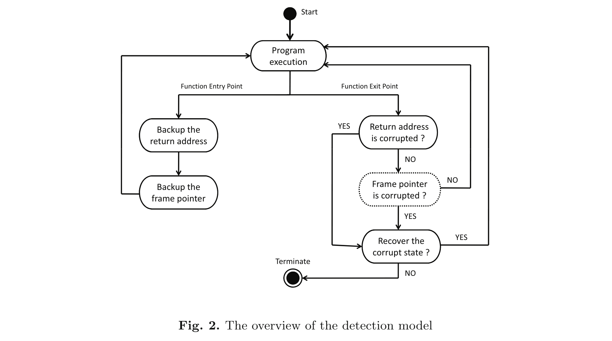

- 在 Heap 上申请一块额外的空间，进行备份


# 台湾交通大学 National Chiao Tung University (NCTU)

台湾交通大学前身为1896年创立于上海的南洋公学，即后来的交通大学。

- 1949 年后，上海的交通大学由上海市军管会高教处接管，即今上海交通大学。

- 1958 年原交通大学的学院及校友在台复校而建立台湾交通大学。

在海峡两岸，台湾交通大学与北京交通大学、西南交通大学、上海交通大学、西安交通大学，共称「五校一家」。


## 【2019】Translating AArch64 Floating-Point Instruction Set to the x86-64 Platform

- 太长不看版本

```markdown
- 在 mc2llvm 上添加了浮点 RM、exception 支持，详细分析了各个细节的实现（基本靠手写）
```

- [1] YiPing You, [2] TsungChun Lin, [3] Wuu Yang (NCTU)
- *Proceedings of the 48th International Conference on Parallel Processing: Workshops* 
- 扩充了 mc2llvm 添加了浮点支持

> We extend mc2llvm, which is an LLVM-based retargetable 32-bit binary translator developed in our lab in the past several years, to support 64-bit ARM instruction set

- 添加了各种浮点 RM 的支持

> For floating-point instructions, due to the lack of floating-point support in LLVM [13, 14], we add support for the flush-to-zero mode, not-a-number processing, floating-point exceptions, and various rounding modes.

- 基本上是手写各种情况

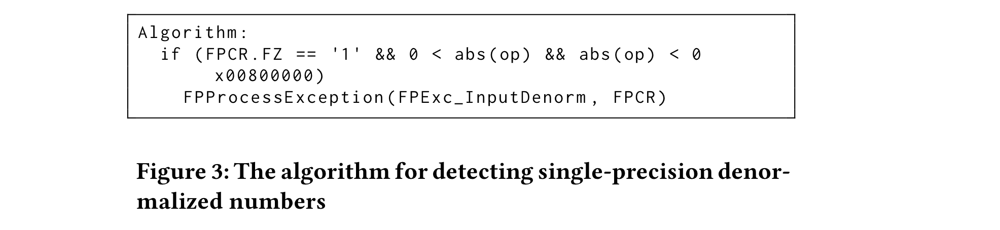

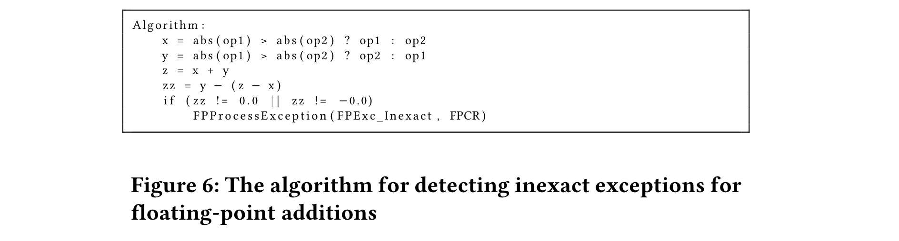


## 【2017】On Static Binary Translation of ARM/Thumb Mixed ISA Binaries

- 太长不看版

```markdown
- 对于混杂的二进制，如 ARM 和 Thumb 在静态翻译中需要区分代码
- 简单直接的方式：两种都翻译，但是 code size 会变大，而且对于 branch 需要区分两种情况
- Code Discovery Analysis：依据入口、跳转等找到 safe area 并只翻译一次，其余 unknown 的翻译两次，但无法反汇编则会被抛弃
```

- [1] JiunnYeu Chen, [2] Wuu Yang, [3] Wei Chung Hsu, [4] BorYeh Shen, [5] QuanHuei Ou, (NCTU)
- *ACM Transactions on Embedded Computing Systems* 
- 会议版本：[【2013】Effective code discovery for ARM/Thumb mixed ISA binaries in a static binary translator](#【2013】Effective code discovery for ARM/Thumb mixed ISA binaries in a static binary translator)
- 静态分析中，找到代码所在的位置是一个关键的问题

> Code discovery has been a main challenge for static binary translation, especially when the source instruction set architecture has variable-length instructions, such as the x86 architectures.
>
> Due to embedded data such as PC (program counter)-relative data, jump tables, or paddings in the code section, a binary translator may be misled to translate data as instructions.

- ARM 虽然是 RISC 但的确混杂了 32-bit 和 16-bit 指令集

> Although ARM is considered a reduced instruction set computer architecture, it does allow the mix of 32-bit (ARM) instructions and 16-bit (Thumb) instructions in the same executables

- 我们提出了一个方法来区分 ARM 和 Rhumb，区分不了的时候就都翻译出来

> We propose a novel solution to statically translate stripped ARM/Thumb mixed executables.
>
> Our solution is implemented in a static binary translator.
>
> The binary translator further generates multiple versions of translated code for the code regions whose types cannot be determined with our solution.

- 扩展了 LLBT 来处理这种 ARM/Thumb mixed 情况

> This section describes how to extend LLBT to translate an ARM/Thumb mixed ISA executable, including both unstripped and stripped executables.

- 对于 Unstripped 可以通过符号表
- 对于 Stripped 则全部翻译，dual translation。但是存在很多问题（code size，branch）

> Our translator translates every code region into both an ARM region and a Thumb region.
>
> At runtime, the correct region will be chosen according to the current processor state.

- 设立了一个 code discovery analysis

> The code discovery analysis has two steps: the safe-region analysis and the unknown region analysis.
>
> - safe-region analysis 沿着跳转寻找安全的区域，这些可以被翻译成一份
>
> > The safe-region analysis combines a linear-sweep algorithm and a recursivetraversal algorithm.
> >
> > 多种入口被视为 safe entry
> >
> > - Executable Entry Point
> > - FunctionEntries
> > - Information for Exception Handling
> > - Information for Dynamic Linking
> >
> > All instructions in the safe region have the same ISA type as the safe entry
>
> - unknown region analysis  将被翻译成两份，但遇到无法翻译的时候会被直接抛弃
>
> > The unknown-region analysis is speculative in that the bytes are disassembled both as ARM instructions and as Thumb instructions

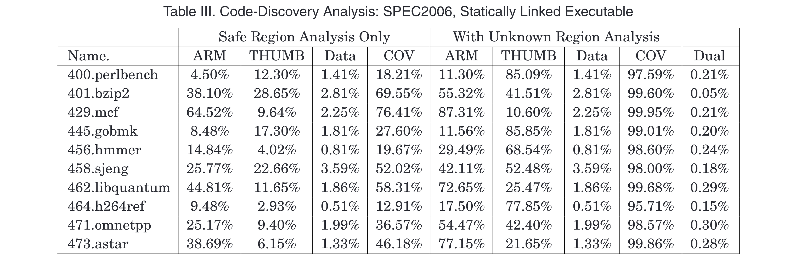

- 最终效果似乎都来自 unknown 的情况，仅靠 Code Discovery Analysis 远远不够
  - 没有【仅 unknown analysis】 和【 safe + unknown】 这两种方案的对比，有的话就可以看到 safe analysis 方案的效果有多大


## 【2015】Instruction Emulation and OS Supports of a Hybrid Binary Translator for x86 Instruction Set Architecture

- 太长不看版

```markdown
- 结合了 Static 和 Dynamic 的二进制翻译器，起名 HBT
- Guest -> LLVM MC IR -> LLVM IR -> Host
```

- [1] I-Chun Liu, [2] I-Wei Wu, [3] Jean Jyh-Jiun Shann, (NCTU)
- *2015 IEEE 12th Intl. Conf. on Ubiquitous Intelligence and Computing,* 
- *2015 IEEE 12th Intl. Conf. on Autonomic and Trusted Computing* and 
- *2015 IEEE 15th Intl. Conf. on Scalable Computing and Communications and its Associated Workshops (UIC-ATC-ScalCom)*  
- HBT 是结合了 static 和 dynamic 的二进制翻译器

> In this paper, we present an HBT which supports x86 ISA and emulates the execution behavior of an x86 executable under Linux operation system.
>
> This HBT use **LLVM Machine Code (MC)** toolkit to disassemble the source ARM executable to get the corresponding LLVM MC intermediate representation (IR) and then translates the MC IR into LLVM IR.
>

- LLVM MC 应该是直接用 LLVM IR 来表示反汇编的结果，文章中也给出了一个例子

> LLVM-MC toolkit is a sub-project of LLVM and is being created to solve the problems under CPU instruction level, such as assembly, disassembly, object file format handling, and so on [17].
>
> For each original x86 instruction, it may be classified into multiple MCInsts according to the size and the types of its operands.

```
[17] "Intro to the LLVM MC Project," 9 Apr. 2010. [Online]. Available: http://blog.llvm.org/2010/04/intro-to-llvm-mc-project.html.
```

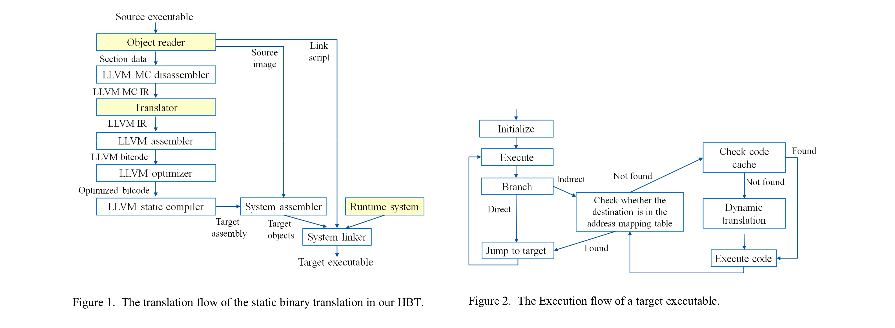


## 【2015】Automatic validation for binary translation

- 太长不看版

```markdown
- 将 Guest（用 QEMU 执行） 和其他 DBT 一起执行，动态对比数据，进行验证
- 核心：通过 QEMU 来 fork 出两个线程同时执行，共享地址空间、function wrapper 等，便于对比
```

- [1] JiunnYeu Chen, [2] Wuu Yang, [3] BorYeh Shen, [4] YuanJia Li, [5] WeiChung Hsu, (NCTU)
- *Computer Languages, Systems & Structures* 
- 原程序和翻译器同时执行，并进行校验

> In our validation tool, the original binary code and the translated binary code run simultaneously.
>
> Both versions of the binary code continuously send their architecture states and the stored values, which are the values stored into memory cells, to a third process, the validator.

- 尽可能的将不同的部分变成相同的

> In our validator, we take special care to make memory layouts exactly the same and make the corresponding system calls always return exactly the same values in the original and in the translated binaries.

- 针对的是 LLBT 这个静态翻译器
  - 实际上是用 QEMU 来执行左半边的部分，右半边的部分进行插桩

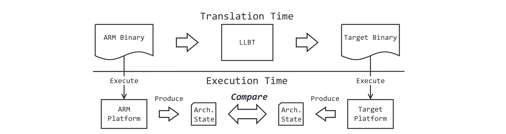

- 挑战和解决方式：不同的 memory layout，系统调用的返回值，对比内存的读写数据
  - 有趣的方式，通过 QEMU 来 fork 出两个线程进行执行，这种很多数据都自然就相同了
  - 两个线程共用相同的系统调用 wrapper 函数

> In our validation model, QEMU will first allocate the emulated ARM stack, and then fork two processes to run QEMU and the translated program, respectively. 
>
> Note that both child processes automatically inherit the entire virtual address space from the parent (QEMU) process, which includes the emulated ARM stack.


## 【2014】A Retargetable Static Binary Translator for the ARM Architecture

- 太长不看版

```markdown
- LLBT 的设计与实现：整体框架，寄存器分配、间接跳转、指令翻译、代码发现
```

- [1] BorYeh Shen, [2] WeiChung Hsu, [3] Wuu Yang, (NCTU)
- 是 LLBT

> In this article, we designed and implemented a new SBT tool, called LLBT, which translates ARM instructions into LLVM IRs and then retargets the LLVM IRs to various ISAs, including ×86, ×86–64, ARM, and MIPS.

- 利用了 LLVM 丰富的 optimizations 和强大的 retargetability

> LLBT leverages two important functionalities from LLVM: comprehensive optimizations and retargetability.

- 也是必须要 runtime 的支持才行

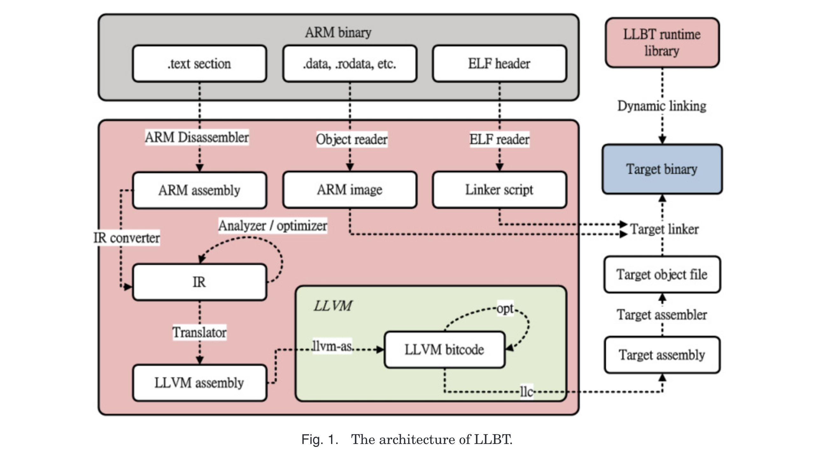

- 寄存器分配：使用LLVM来

> In LLBT, we allocate architectural states as LLVM local variables and rely on LLVM’s register promotion optimizations to promote local variables to virtual registers and LLVM’s global register allocation to map as many virtual registers to physical target registers as possible.
>
> LLBT declares ARM registers and condition flags as local variables, which are allocated by the LLVM alloca instruction.
>
> The LLVM optimizer will take care of promoting local variables from memory references to register references and then map them to physical registers through the global register allocation phase

- 指令翻译：主要是 condition 比较麻烦
- 处理间接跳转：Address Mapping Table (AMT)，但只处理可能成为间接目标的地方

> it maintains entries for the source instructions that can possibly be destinations of an indirect branch for compiler-generated instead of hand-crafted binaries, which include (1) return addresses, (2) function entry points, and (3) the addresses stored in jump tables.

- 使用本地指令来实现针对 ARM 的特殊 helper 库（比如软浮点模拟）

> ARM defines a set of runtime helper functions, which are implemented in a compiler’s runtime library (such as libgcc) for emulating floating-point and integer division operations.

- Code DISCOVERY 问题：ARM 和 Thumb

> Normally, the ARM toolchain generates some special symbols in ARM binaries that can help identify ARM, Thumb, and data regions in the binaries.
>
> 以及各种方式处理 stripped

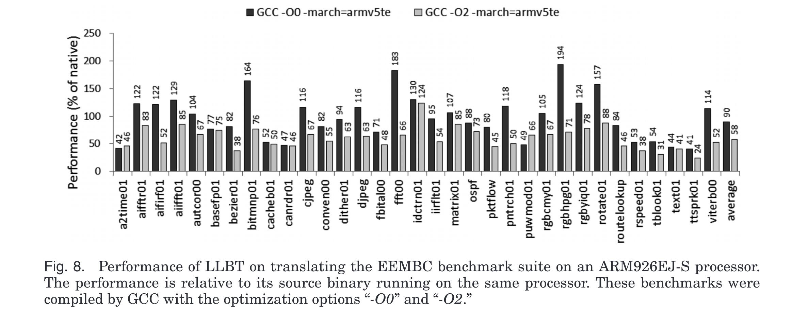


## 【2013】Effective code discovery for ARM/Thumb mixed ISA binaries in a static binary translator

- 期刊版：[【2017】On Static Binary Translation of ARM/Thumb Mixed ISA Binaries](#【2017】On Static Binary Translation of ARM/Thumb Mixed ISA Binaries)
- [1] JiunnYeu Chen [2] BorYeh Shen [3] QuanHuei Qu [4] WuuYang [5] WeiChung Hsu (NCTU)
- 生成多份，以供 runtime 选择使用

> We have proposed a novel solution to statically translate the stripped executables for the ARM/Thumb mixed ISA. 
>
> Our static binary translator includes a translation pass which guarantees the correctness of the translated executable by generating multiple versions of translated code for runtime selection.

- 加了一系列优化，减少了代码生成量

> The binary translator also includes a series of optimization analyses which discover and remove most of the code generated in the baseline translation.

- 代码发现分析：safe region 和 unknown region


## 【2012】An LLVM-based hybrid binary translation system

- 太长不看版

```markdown
- HBT = SBT + DBT，使用 LLVM 处理寄存器分配，此外有典型的跳转处理（查表、间接跳转）
```

- [1] BorYeh Shen [2] JyunYang You [3] Wuu Yang [4] WeiChung Hsu (NCTU)
-  *2012 7th IEEE International Symposium on Industrial Embedded Systems (SIES)* 
- 结合动态和静态，利用 LLVM 来翻译、优化

> In this paper, we present a hybrid binary translation (HBT) system which combines the merits of both SBT and DBT. It leverages the LLVM infrastructure to translate source binary code, optimize, and generate target binary code.

- 快进到 implementation 部分

> 1. Hybrid Translation
> 2. Indirect Branch Handling: AMT + DBT
> 3. Register Mapping: LLVM Global Variable
> 4. Finding Indirect Branch Addresses: 
> 5. Block Chaining

- 比 DBT 快 4-20 倍，测试程序为 EEMBC v1.1

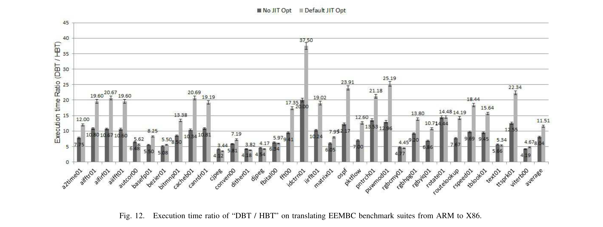




## 【2012】LLBT: an LLVM-based static binary translator

- 太长不看版本

```markdown
- LLBT 是一个基于 LLVM 的 Static Binary Translator
- 诸多问题包括：
	- ARM的代码发现（Thumb）
	- 寄存器分配（LLVM）
	- 指令翻译（Condition Code）
	- 间接跳转（Address Mapping Table，只针对可能成为目标的地址，比如函数头、返回地址、函数指针、C++虚函数表)
	- 优化：跳转表恢复（处理编译器特殊行为）
	- 恢复 PC-Related Data（处理编译器特殊行为）
	- 替换 helper 函数：源于编译器针对无浮点等特定的平台，编译出 softfloat 等库函数的调用（替换为本地浮点指令）
```

- [1] BorYeh Shen [2] JiunnYeu Chen [3] WeiChung Hsu [4] Wuu Yang (NCTU)

- 基于 LLVM 的 SBT

> In this paper, we designed and implemented a new portable SBT tool, called LLBT, which translates source binary into LLVM IR and then retargets the LLVM IR to various ISAs by using the LLVM compiler infrastructure.
>
> Using the LLVM compiler infrastructure, LLBT successfully leverages two important functionalities from LLVM: the comprehensive **optimizations** and the **retargetability**.
>
> - 利用 LLVM 的 global variable 来自动处理、优化 DBT 中的寄存器映射问题
>
> LLBT can treat the complete application binary as a single function and uses the global register allocation optimization in LLVM to consistently map guest architecture states in host registers so as to avoid the costly state saving and reloading at trace/block exits.

- 实现上的问题：

> - Code Discovery
> - Register Mapping
> - Instruction Translation
> - Handling Indirect Branches
> - Jump Table Recovery
> - PC-relative Data Inlining
> - Helper Function Replacement
