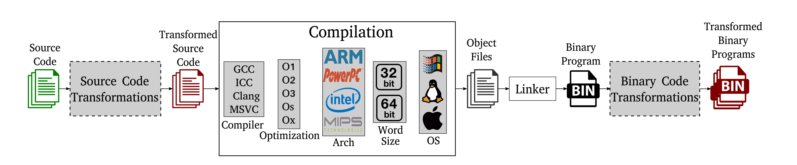
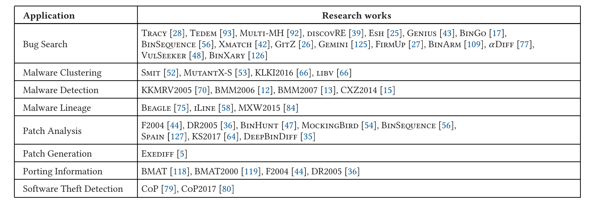
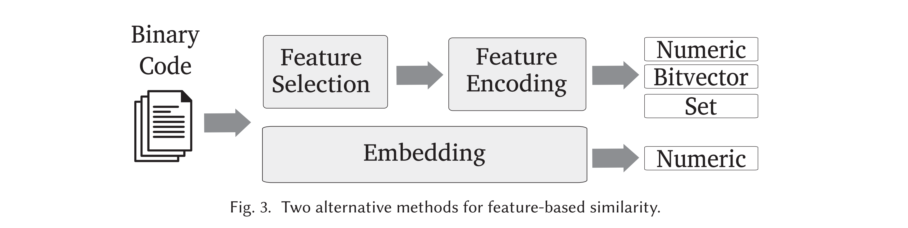

二进制代码相似度的对比

- 起源于 patch 的需求，后来出现语义对比，后来主要用于 bug search
- 对比结果通常分为三种：一模一样、功能等价、相似。

- 对比的粒度有多种，包括 block、function 等等

- 对比的方法有多种，如代码语义的对比（符号计算、输入输出测试）、代码结构的对比（主要是图结构的相似度）
  - 近几年也出现基于特征的、使用神经网络的对比方式
- cross-architecture 指的是可以对比不同架构，但多是 similarity
- 执行的时机即 static 和 dynamic，本文分析的工具多是 static（大多实现于 IDA 工具里）


# 2021 A Survey of Binary Code Similarity

- Binary code similarity approaches **compare two or more pieces of binary code**, e.g., 
  - basic blocks,
  - functions, 
  - or whole programs, 
  - **to identify their similarities and differences**.
-  Comparing binary code is fundamental in scenarios where **the program source code is not available**, which happens with
  - commercial-of-the-shelf (COTS) programs, 
  - legacy programs, 
  - and malware

- Binary code similarity has a wide list of real-world applications such as 
  - bug search [17, 25–28, 39, 42, 43, 48, 56, 77, 92, 93, 109, 125], 
  - malware clustering [52, 53, 66], 
  - malware detection [12, 15, 70], 
  - malware lineage [58, 75, 84], 
  - patch generation [5], 
  - patch analysis [36, 44, 47, 54, 56, 64, 127], 
  - porting information across program versions [36, 44, 118], 
  - and software theft detection [79].

- Identifying binary code similarity is challenging
  -  much program semantics are lost due to the **compilation** process including function names, variable names, source comments, and data structure definitions.
  -  the binary code may change if the source is **recompiled**, due to secondary changes introduced by the compilation process. For example, the resulting binary code can significantly change when using different compilers, changing compiler optimizations, and selecting different target operating systems and CPU architectures. 
  -  **obfuscation** transformations can be applied on both the source code and the generated binary code, hiding the original code

-  The **approach** systematization includes
  -  the number of input pieces of binary code being compared (e.g., one-to-one, one-to-many, many-to-many);
  -  the granularity of the pieces of binary code analyzed (e.g., basic blocks, functions, programs); 
  - whether the comparison happens at the syntactical representation, the graph structure, or the code semantics;
  - the type of analysis used (e.g., static, dynamic, symbolic);
  - the techniques used for scalability (e.g., hashing, embedding, indexing)
- The **implementation** systematization  includes 
  -  the binary analysis platforms used to build the approach
  -  the programming languages used to code it
  - the supported architectures for the input pieces of binary code being compared
  - whether the approach is publicly released
- The **evaluation** systematization covers
  -  the datasets on which the approaches are evaluated
  -  the evaluation methodology including the type of evaluation
  - how the robustness of the approach is evaluated in the face of common code transformations such as changes in compiler and compilation options, different architectures, and obfuscation.


## Overview -  Compilation Process

- Source Code Transformation & Binary Code Transformation



- **A main challenge in binary code similarity is that the compilation process can produce different binary code representations for the same source code.**


## Overview - Binary Code Similarity

- Binary code similarity approaches compare *pieces of binary code*
  -  the type of the comparison (identical, similar, equivalent)
  -  the granularity of the pieces of binary code being compared (e.g., instructions, basic blocks, functions)
  -  the number of input pieces being compared (one-to-one, one-to-many, many-to-many)
- **Comparison type**
  - Two (or more) pieces of binary code are **identical** if they have the same syntax, i.e., the same **representation**.
  - Two pieces of binary code are **equivalent** if they have the same **semantics**, i.e., if they offer exactly the same functionality.
  - Two pieces of binary code can be considered similar if their syntax, structure, or semantics are **similar**.

- **Comparison granularity**
  - the *input granularity*, i.e., the granularity of the input pieces of binary code that the approach compares, 
  - the *approach granularities*, i.e., the granularities of the different comparisons in the approach.
- **Number of inputs**
  - One-to-one approaches compare an *original* piece of binary code (also called source, old, plaintiff, or reference) to a *target* piece of binary code (also called new, patched, or upgrade).
  - One-to-many approaches compare a *query* piece of binary code to many target pieces of binary code. 
  - In contrast to *OO* and *OM* approaches, many-to-many approaches do not distinguish between source and target pieces. 


## Applications




## Evaluation

### **The origins.** 

起源于自动生成 patch 的需求：连续版本的 diff、减少网络传输

- The origins of binary code similarity are in the problem of **generating a patch** (or delta) that captures the differences between two consecutive (or close) versions of the same program.
  - Text diffing tools
  - low bandwidth communication networks =>  transmitting a small patch
-  Several tools for generating and applying binary patches soon appeared such as RTPatch [103], BDiff95 [22], and xDelta [121]. Those tools worked at byte level and could diff any type of file.
- 1999, **Exediff** [5], which generated patches for DEC Alpha executables.
- 1999, **BMAT** [118], a tool that aligned two versions of a Windows DLL library executable to propagate profile information from the older (extensively profiled) version to a newer version

### **The first decade** 2000-2009

**语义**相似度开始出现

- extend binary code similarity from purely syntactical to also include **semantics** 
- 2004, Thomas Dullien (alias Halvar Flake) proposed a **graph-based binary code diffing approach** that focused on the structural properties of the code by heuristically constructing a call graph isomorphism that aligns functions in two versions of the same binary program [44].
  - the first approach to handle instruction reordering inside a function introduced by some compiler optimizations.
- 2005,  Kruegel et al. [70] proposed **a graph coloring technique** to detect polymorphic variants of a malware.
  - This is the first approach that performed **semantic** similarity and MM comparison.
  - They categorized instructions with similar functionality into **14 semantic classes**.
-  2008, Gao et al. proposed BinHunt [47] to identify semantic differences between two versions of the same program
  - This is the first approach that checks code **equivalence**.
  - It uses **symbolic execution and a constraint solver** to check if two basic blocks provide the same functionality.
- 2009, Hu et al. presented Smit [52], an approach that given a malware sample finds similar malware in a repository.
  -  Smit is the first OM and binary code search approach

### **The last decade** 2010-2019

主要应用于**寻找 BUG**：对于已知问题搜索程序其他部分是否有相似的错误

-  The focus on this decade has been on **binary code search approaches**, with an emphasis since 2015 on its cross-architecture version (17 approaches), and in recent years on machine learning approaches.
  - 2013, Wei et al. proposed Rendezvous, a binary code search engine that, given the binary code of a query function, finds other functions in a repository with similar syntax and structural properties
- Most binary code search approaches target the **bug search application**.
  - first addressed on source code in 2012 by Jang et al. [57]
  - 2014, David and Yahav proposed Tracy [28], the first binary code search approach focused on bug search.
    - Tracy used the concept of *tracelets*, **an execution path in a CFG**, to find functions similar to a vulnerable function
  - 2015, Pewny et al. presented Multi-MH [92], the first cross-architecture binary code search approachs
    - Multi-MH indexed functions by their input-output semantics
  - 2016, Lageman et al. [71] trained a **neural network** to decide if two functions were compiled from the same source code. The use of neural networks has picked up since then, e.g., Gemini (2017), *α*Diff (2018), InnerEye (2019), Asm2Vec (2019), and DeepBinDiff (2020).


## APPROACHES

### 粒度 **Granularity**

- instruction (I), 
- set of related instructions (I*),
- basic block (B), 
- set of related basic blocks (B*),
- function (F), 
- set of related functions (F*), 
- trace (T),
- and whole program (P)

### 语法相似度 **Syntactic Similarity**

- Syntactic approaches capture similarity of the code representation; more specifically, they **compare sequences of instructions**.
-  When the stride is one, the resulting sequence is called an **n-gram**.
- The most common methods to compare instruction sequences are **hashing**, **embedding**, and **alignment**.

### 语义相似度  **Semantic Similarity**

- Semantic similarity captures if the code being compared has **similar functionality**
- 添加语义信息 **Incorporating semantics**
  - A basic approach to compute semantic similarity is to add semantic information
- 符号表达 **Symbolic formulas** 
  - A symbolic formula is an assignment statement in which the left side is an output variable and the right side is a logical expression of input variables and literals that captures how to derive the output variable.
  - *Theorem prover*：BinHunt introduced the idea of using theorem provers such as STP [46] or Z3 [30] to check if two symbolic formulas are equivalent
  - *Semantic hashes*：An alternative to using a theorem prover is to check if two symbolic formulas have the same hash after normalizing the formulas and simplifying them.
  - *Graph distance*：Xmatch and Tedem represent the symbolic formula of a basic block as a tree and compute their similarity by applying graph/tree edit distance.
- 输入输出测试 **Input-output pairs**
  -  Intuitively, two pieces of binary code are functionally equivalent if given **the same input they produce the same output**, for all possible inputs

### 结构相似度  **Structural Similarity**

- Structural similarity computes similarity on **graph** representations of binary code.
- The three most common are // All three are directed graphs
  - the intra-procedural control flow graph (CFG), 
  - the ICFG, 
  - and the callgraph (CG)
- The intuition behind structural approaches is that CG, ICFG, and CFGs are fairly **stable representations** whose structure varies little for similar code
- **(Sub)graph isomorphism**
- **Optimization**  model graph similarity as an optimization problem
- **K-subgraph matching**
- **Path similarity**
- **Graph embedding**

### 特征相似度 **Feature-Based Similarity**

- A common method (30 approaches) to compute similarity is to **represent a piece of binary code as a vector or a set of features** such that similar pieces of binary code have similar *feature vectors* or *feature sets*.
- 

### 哈希 **Hashing**

-  three classes of hashes have been used for binary code similarity:
  - cryptographic hashes //  to quickly identify duplicates at fine granularity
  - locality-sensitive hashes // similar hash values for similar inputs
  - executable file hashes //  to output the same hash value for polymorphic variants of the same malware.
- **Locality-sensitive hashing (LSH)** 
  - LSH is used in binary code similarity to boost performance
  - Fuzzy hashing is a popular type of LSH used to compute similarity of arbitrary files
- **Executable file hashes.** 
  - They are designed to output the **same hash value** for polymorphic variants of the **same malware**.

### 架构 **Supported Architectures**

- A **cross-architecture** approach can compare pieces of binary code for different CPU architectures
  - This differs from architecture-independent approaches (e.g., F2004) that support different architectures; but cannot cross-compare among them
  - A common application is given a buggy piece of binary code to search for similar pieces of binary code compiled for other architectures,
- cross-architecture approaches compute semantic similarity
  - The code syntax for different architectures may significantly differ as they may use separate instruction sets with different instruction mnemonics, sets of registers, and default calling conventions

### 分析的类型 **Type of Analysis**

Binary code similarity approaches can use **static** analysis, **dynamic** analysis, or **both**. 

### 归一化 **Normalization**

Syntactic similarity approaches often normalize instructions, so that two instructions that are normalized to the same form are considered similar despite some syntactic differences

- **Operand removal** 
- **Operand normalization**
- **Mnemonic normalization**


## IMPLEMENTATIONS

- Distributed
- Use IR
- Firmware
- x86、x86_64
- ARM、MIPS、Other
- Windows、Linux、MacOS
- Open Source、Free Binary


## EVALUATIONS

- 测试集 **Datasets**
- **Methodology**
  - 鲁棒性 **Robustness**
  - 准确性 **Accuracy evaluation and comparison**
  - 性能 **Performance**


## DISCUSSION

- 小代码片段 **Small pieces of binary code**
  - Many binary code similarity approaches ignore small pieces of binary code, setting a threshold on the minimum number of instructions or basic blocks to be considered
  - Small pieces of binary code are **challenging** because 
    - they are common, may consist of a single basic block that prevents structural analysis, 
    - and may have identical syntax despite different semantics
- 源代码和二进制的对比 **Source-to-binary similarity**
  - Some applications like plagiarism detection may require source code to be compared with binary code
  - Recently, source to-binary similarity has been applied for **searching** if a known **bug** in open source code exists in some target binary code [131]
- 数据相似度 **Data similarity**
  - 本文只关心了 code 但 data 可能也很重要
- 语义关系 **Semantic relationships**
  - A different aspect of semantic similarity is to identify binary code with *related* functionality
  - 识别出功能上有关系的代码，比如加密和解密
- 可扩展性 **Scalability**
  - 处理巨量的数据
  - further improvements on scalability will be needed to realize the vision of binary code search engines
- 混淆 **Obfuscation**
  - Many challenges still remain for binary code similarity on obfuscated code
- 方法的对比 **Approach comparison**
  - 还是很难：The variety of datasets and methodologies used to evaluate the approaches (e.g., top *k* evaluation for OM approaches), together with the absence of source code for many of them, makes it **hard** to perform a fair comparison to understand their benefits and limitations
- 神经网络 **Applying recent advances on neural networks.**
  - In the last 3 years multiple binary code similarity approaches have leveraged neural networks (e.g., Gemini, *α*Diff, InnerEye, Asm2Vec, Deep BinDiff). 


# PIN

### iLine [58]

```
[58] Jiyong Jang, Maverick Woo, and David Brumley. 2013. Towards automatic software lineage inference. In USENIX Security Symposium.
```

- we systematically study software lineage inference by exploring four fundamental questions not addressed by prior work.
  - how do we automatically **infer** software lineage from program binaries?
  - how do we measure the **quality** of lineage inference algorithms?
  - how useful are **existing approaches** to binary similarity analysis for inferring lineage in reality, and how about in an idealized setting?
  - what are the **limitations** that any software lineage inference algorithm must cope with?

- we build ILINE, a system for automatic software lineage inference of program binaries, and also IEVAL, a system for scientifific assessment of lineage quality.

### Blex [38]

```
[38] Manuel Egele, Maverick Woo, Peter Chapman, and David Brumley. 2014. Blanket execution: Dynamic similarity testing for program binaries and components. In USENIX Security Symposium.
```

- 识别相似的函数

>  identifying similar functions among binary executables

- 以前基于语义的方法不太行

> Recent work tries to establish semantic similarity based on static analysis methods
>
> these methods do not perform well if the compared binaries are produced by different compiler toolchains or optimization levels

- 我们提出了个好方法，识别收集函数的副作用

> we propose *blanket execution*, a novel dynamic equivalence testing primitive that achieves complete coverage by overriding the intended program logic
>
> - Blanket execution **collects the side effects of functions** during execution under a controlled randomized environment
> - Two functions are deemed similar, if their corresponding side effects, as observed under the same environment, are similar too.

### KLKI2016 [66]

```
[66] TaeGuen Kim, Yeo Reum Lee, BooJoong Kang, and Eul Gyu Im. 2016. Binary executable file similarity calculation using function matching. Journal of Supercomputing 75, 2 (Dec. 2016), 607–622.
```

- we proposed a similarity calculation method for binary executable fifiles, based on function matching techniques. 
- Attributes of a function are extracted and these attributes are used to match functions of two binary fifiles.
- Our function matching process is composed of three steps: 
  - the function name matching step,
  - the N-tuple matching step,
  - and the fifinal n-gram-based matching step.

### KS2017 [64]

```
[64] Ulf Kargén and Nahid Shahmehri. 2017. Towards robust instruction-level trace alignment of binary code. In
IEEE/ACM International Conference on Automated Software Engineering.
```

- Trace Alignment 就是将两个不同但语义相近的动态指令执行序列联系起来

> Program trace alignment is the process of establishing a correspondence between dynamic instruction instances in executions of two semantically similar but syntactically different programs.

- 我们提出了一个方法

> we present what is, to the best of our knowledge, the fifirst method capable of aligning realistically long execution traces of real programs.
>
> - works entirely on the machine code level
> - based entirely on dynamic analysis

### IMF-sim [116] 

```
[116] Shuai Wang and Dinghao Wu. 2017. In-memory fuzzing for binary code similarity analysis. In IEEE/ACM International Conference on Automated Software Engineering.
```

- 提出了一个新的检测 similar functions 的方法

> In this paper, we present a novel method that leverages inmemory fuzzing for binary code similarity analysis.
>
> - The **similarity score** of two behavior traces is computed according to their longest common subsequence
> - To compare two functions, a **feature vector** is generated, whose elements are the similarity scores of the behavior trace-level comparisons
> - We train a **machine learning model** through labeled feature vectors; later, for a given feature vector by comparing two functions, the trained model gives a fifinal score, representing the similarity score of the two functions


